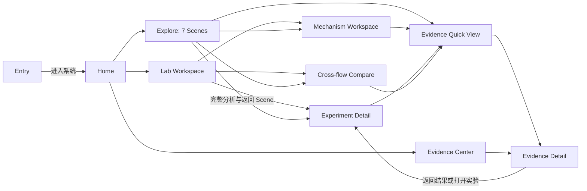

# ShockPath V1 — User Flow & Information Architecture

文档版本：V1.0 · Phase 3 · 2026-09-30（Asia/Shanghai）  
文档状态：**FROZEN（V1.0，用户确认的轻量冻结）；不改变范围、数据或 PRD 冻结。**  
输出位置：`D:\code_project\CFD_visiblesystem\docs\03_USER_FLOW_AND_IA.md`

## 轻量冻结记录

用户确认日期：2026-09-30（Asia/Shanghai）。仅在本文件记录 IA 决策，不新增冻结清单或其他文件，不启动下一阶段。

```text
IA_VERSION=V1.0
IA_STATUS=FROZEN
RECOMMENDED_IA=HYBRID_SHARED_SCIENTIFIC_WORKSPACE
TOP_LEVEL_NAV_COUNT=4
NAVIGABLE_PAGE_TEMPLATE_COUNT=9
FUNCTIONAL_ALPHA_PAGE_COUNT=5
```

`FUNCTIONAL_ALPHA_PAGE_COUNT=5` 对应第17节 Case8 首个纵向切片的最小页面集，不表示只实现五个页面即可完成 PRD 中完整 Functional Alpha 的全部功能。

本轮只定义页面职责、信息层级、用户流程、导航、支持能力和状态表达。没有编写前后端、API、Data Schema、CSS 或视觉特效，没有启动 CFD，没有修改上游文档与科研资产。

## 上游依据与用户补充

已完整阅读以下三份上游文档，并完整加载、解析 Phase 1 JSON 索引，核对支持矩阵、语义、缺口、回放候选与相关资产记录；未重新开展数据盘点：

| 上游 | 本次实际读取位置 | 继承内容 |
| --- | --- | --- |
| Phase 0 | `D:\code_project\CFD_visiblesystem\docs\00_PROJECT_SCOPE.md` | `V1_SCOPE_FREEZE`、科学主张边界、七模块与十项 P0 工作项 |
| Phase 1 正式报告 | `D:\比赛\数媒\data\01_DATA_ASSET_INVENTORY.md` | 实际数据能力、粒度、状态、来源与禁止表达 |
| Phase 1 机器索引 | `D:\比赛\数媒\data\data_asset_inventory.json` | 2337 条资产记录、七模块、十项支持记录、19 条科学量语义、8 项缺失资产 |
| Phase 1 冻结记录 | `D:\比赛\数媒\data\DATA_INVENTORY_FREEZE.json` | 盘点文件版本与 hash；不把全部资产自动升级为冻结证据 |
| Phase 2 | `D:\code_project\CFD_visiblesystem\mind_design\02_ShockPath_PRD_V1.md` | Functionality First、真实支持组合、P0 功能和 Case8 首切片 |

软件目录 `data` 中存在 Phase 1 副本；本轮使用用户指定的 `D:\比赛\数媒\data` 正式文件为准，不搬运、不覆盖副本。PRD 位于 `mind_design`，不因目录不同生成另一份 PRD。

用户本轮要求纳入 IA：

> 访问网站首先进入独立入口页，点击“进入系统”才进入系统。最终入口可由用户制作动态页面；当前先保留简单静态内容和按钮。前端审美暂不作为重点，优先功能完整，整个系统完成后再统一优化。

因此本阶段只定义该入口的职责与后续实现要求，不提前实现静态页面或动态效果。Product Design 用于产品流程与信息层级梳理；本任务明确要求文本 IA，不启动图像选型或 UI 原型工作流。

# 1. IA Goals

ShockPath V1 是“以科学可视分析为产品外壳、以真实 CFD Solver 和冻结实验为计算与证据内核的科研数字实验与可视分析平台”。

保持机制链：

`Parameter → Dissipation Pathway → Entropy Production → Trajectory Budget → Spatial Allocation → Modal Response → Macroscopic Response`

IA 的目标按顺序是：

1. 科学量的定义、来源、时间粒度和可用范围清楚。
2. 首次访问遵循“入口页 → 进入系统 → 系统首页”，评委能在 3–5 分钟内走完引导故事。
3. Lab 用户快速从真实实验进入配置、数据、分析和证据；Case8 是默认主干实验。
4. Explore 使用预设科学视图，Lab 开放该视图的全部真实支持控件；二者共享结果与证据。
5. 用少量稳定页面模板承载异构实验，适合前后端按纵向切片逐步联通。
6. 高保真 UI、动态入口、复杂转场统一后置，不让视觉工作阻塞 P0。

本文件的 PASS 指 IA 文档完整性与上游约束一致性，不表示系统已开发或科学结果已经重新验证。

# 2. Design Constraints

## 2.1 范围与阶段

- 七个核心模块固定，不增加第八个 P0 主模块。入口页、首页、模式容器属于产品结构，不是新增科学模块。
- Replay 是 V1 默认运行语义。页面使用“查看实验 / 查看已记录结果”，不用“开始计算”暗示现场执行求解器。
- Live Demo、完整 Experiment Manager、导出、报告、用户账号、数据库、后台任务均不进入本轮 P0 IA 必需项。
- 本阶段不定数据字段结构、REST 路径、数据库、前端框架或组件代码。
- scope 中早期阶段顺序与 PRD 后续建议不同之处，执行用户本轮阶段说明及 Functionality First 的纵向切片策略；不改写原冻结文件。

## 2.2 数据限制必须成为操作限制

| 数据族 | 真实支持 | IA 中允许 | IA 中禁止 |
| --- | --- | --- | --- |
| Case8 A_u/B_u/C_u/D_u | 每配置 1912 accepted-step 标量记录、六帧真实流场与 endpoint 瞬时 face 诊断 | 两种独立粒度的时间选择；六帧回放；配置比较 | 1912 帧全场、连续 CFD movie、全部 RK-stage 空间回放 |
| Case8 D_u 累计空间诊断 | 既有冻结 DIAGNOSTIC_RERUN、终端轨迹积分 native-face 场 | D_u 专属静态累计分配视图、来源说明 | 推广为 A/B/C/D 都有累计图；累计图播放；冒充原始 production 输出 |
| Gate | Acoustic/Pressure/Ungated 三张 32×128 累计 cell 图及终态 summary | 单 Gate、三图比较、固定窗、窗内外份额、空间累计分配曲线 | map 时间轴、连续 q_at、新参数插值 |
| Spectrum | q_at=0/0.132/0.264/0.396，ell=0…16，68 条谱记录；每 block 512 eigenvalues、top32 左右 eigenvectors | 四档选择、完整模式选择、已存 eigenmode、mixed-sign 位移 | 连续 q_at 生成新谱；把所有模式描述为 improved；承诺矩阵查看 |
| Fig13 | mode=1/4/8/12，q_at=0/0.396，epsilon=1e-4/1e-5/1e-6；24 runs×33 points | 投影幅值 / log 幅值回放、增长率与拟合窗口 | full spatial CFD movie；以 eigenmode 示意替代真实演化 |
| Cylinder | A_u/B_u/D_u；每组 9757-step 标量、五帧瞬时 face 场、16 累计角向扇区与固定 front-band 标量 | 瞬时场、标量历史、静态扇区和 band；非对称跨流动比较 | C_u 配置；full-trajectory cumulative 2D Pi_at heatmap；从扇区反推二维累计场 |
| Entropy Closure / Case7 | B_u CFL=.05；D_u CFL=.2/.1/.05/.025；真实 stage / step 标量日志 | 半离散闭合、全离散 residual、已有 CFL 对照 | 空间轨迹回放；任意 config×CFL 笛卡尔积；exact fully-discrete identity |
| Near-1D | 理论机制可解释；五档 epsilon 缺权威 raw evidence | schematic、条件说明、缺口证据 | 正式 Lab numerical registry、五点数值交互；借用 Fig13 epsilon 填补 |

## 2.3 不能因名称相同而合并口径

Gate 的累计 cell 数组已包含积分测度，`sum(array)=E_at`，不能二次乘 dt 或面积。Case8 D_u 累计 native-face 数组需其 face measure；derived cell average 不能用总和冒充预算。Cylinder 主预算为 interior-only，固定 band 是 cumulative，不是 final-rate。

Gate cell-window、Case8 native-face localization、Cylinder front-band fraction 分别标注。Case8 HF、Cylinder HF-RMS、不同 detector 的 width 不做统一排行榜；检测器下限附近宽度不比较微小优劣。模型单位与 SI 换算未明确时保留“模型单位 / UNKNOWN”，不任意使用 Pa、m/s 等标签。

Phase 1 的 SUPPORTED 表示数据支持，ADAPTER_REQUIRED 表示仍需适配，不等于软件已就绪。FROZEN_VERIFIED 表示相应字节及既有冻结记录核验，不能解释为所有科学结论重新获得证明。

# 3. User Types

| 用户 | 入口与模式 | 主要任务 | 默认信息层级 |
| --- | --- | --- | --- |
| 数媒评委 / 非 CFD 观众 | 入口 → 首页 → Explore | 在 3–5 分钟内理解机制链与主张边界 | 一个主结论、一个有效交互、真实数据 / schematic 标签、证据入口 |
| CFD 学生 / 科研用户 | 入口 → 首页 → Lab；也可科学深链直达 | 选择实验与真实组合，查看数据、分析及 provenance | 完整合法控件、坐标 / 单位 / mask / scope、支持与缺口 |
| 技术评委 / 复现审查者 | 首页或任意结果 → Evidence | 检查 method/config/source/hash，理解冻结和 source drift | 逐资产身份、处理链、验证范围、限制 |

模式是使用方式，不是角色权限。V1 无需登录、模式选择弹窗或用户角色系统。科学深链不强制经过宣传入口，避免评审和分享多一层点击；首次普通访问网站根入口仍严格保留“进入系统”。

# 4. IA Alternatives

三个方案都保留用户要求的入口页；比较的是进入系统后的结构。

| 维度 | A：模块中心 | B：实验中心 | C：混合式，共享科学视图 |
| --- | --- | --- | --- |
| 结构 | 首页加七模块一级入口 | 首页、Explore、Lab、Evidence；科学分析全部放实验详情 | 首页、Explore、Lab、Evidence；实验详情为核心，加机制与跨流动两种共享目的地 |
| 学习成本 | 先理解七个术语，较高 | 按实验定位清楚，但跨实验故事易被详情层级打断 | 普通用户按 Explore、科研用户按 Lab，模式目标清楚 |
| 比赛演示 | 反复跳模块，需额外串联故事 | 引导跳入不同实验 / 标签，容易失去叙事上下文 | 单一引导容器承载七场景，结果仍用同一视图 |
| Lab 效率 | 分析直达快，配置和上下文易散落 | 单实验高效，机制 / 跨流动不宜附属某一个实验 | 单实验 tabs 高效；跨流动和机制各有明确共享位置 |
| 前后端复杂度 | 多独立页重复处理选择器与状态 | 详情模板最集中，但把机制 / 比较硬塞进详情会增特殊分支 | 一个详情模板和少量明确视图，需保留模式 / 返回上下文 |
| 页面复用 | 可以复用图表，页面壳仍重复 | 详情复用高，Explore 容易另写展示图 | Explore 是 curated state，Lab 是 full supported controls，优先完整视图复用 |
| 与真实数据关系一致性 | 以模块分组掩盖各实验不同 capability | 与实验证据关系一致；跨实验分析归属不自然 | 以实验能力决定标签，比较保留两侧独立来源，机制标记 schematic |
| 扩展性 | 新分析容易增加一级导航 | 新实验易加；跨实验任务难归类 | 新实验增加能力配置；已有分析入口复用，不自动新增一级页 |
| 一级导航数 | 8，超出目标且必要性不足 | 4 | 4 |

**RECOMMENDED_IA = C / HYBRID_SHARED_SCIENTIFIC_WORKSPACE**。

选择 C 的原因是科学结果以实验与配置为来源锚点，Explore 又需要跨数据族讲故事。C 同时保留这两种任务的自然路径；不会让 Gate 图看起来来自 Case8 D_u，也不会把共同离散激波的 Spectrum 当成 Case8 的线性化结果。机制解释没有 Near-1D raw scan，跨流动比较有不对称数据，两者都值得明确目的地而非伪造普通 experiment。页面数量只是辅助因素。

# 5. Recommended IA

## 5.1 一级结构与页面数量

**系统内一级导航 4 项：系统首页、引导探索 Explore、实验室 Lab、证据中心 Evidence。**  
网站根入口是系统外的 Entry，点击“进入系统”进入 Home；不占一个科学模块，也不进入系统内一级导航。

回答页面数量时区分三个口径：

- 一级导航目的地：4 个。
- 包含网站入口的顶层入口目的地：5 个（Entry + 上述 4 个）。
- V1 可导航页面模板：9 个；其中 5 个是上述顶层入口，另 4 个是机制工作台、实验详情、跨流动比较、证据详情。第 10 节给出唯一清单。

六类实验、七个 Explore Scene、实验 tabs、eigenmode 详情、证据侧面板均是模板中的状态，不按参数组合扩展成独立页面。不单独建设 About；项目定义、方法边界和限制放首页摘要与 Evidence 概览。

## 5.2 Entry 与 Home 分工

| 层级 | 职责与内容优先级 | CTA | 后续视觉 |
| --- | --- | --- | --- |
| Entry（网站入口） | 项目名 → 一句话身份 → “进入系统”；可有一行说明“真实 CFD 与实验数据驱动” | 唯一主要 CTA：**进入系统** → Home | 当前后续实现只需简单静态页面；用户以后替换为动态入口，按钮目的地不变 |
| Home（系统首页） | 核心科学问题 → 短机制链 → Explore / Lab 入口 → Case8 主线与各实验实际能力摘要 → 来源说明 | primary：**开始引导探索（约 4 分钟）**；secondary：**进入实验室** | 普通内容即可，不要求 hero、动画、最终配色 |

Home 的核心问题：“数值耗散由什么触发、作用到哪里，又如何改变模态与宏观流动？”短机制链只解释层次，不展示未经加载的正式数值。

Home 的科学状态摘要显示 Case8、Gate、Spectrum / Validation、Cylinder 各自支持范围，例如“6 帧 + 标量历史”“静态累计图”“离散谱与短时幅值”“5 瞬时帧 + 16 累计扇区”。入口不能只用几张外观相同的卡片暗示能力相同。项目可有“基于已核验 / 冻结证据”说明，但不能给整个系统一个 FROZEN_VERIFIED 徽章覆盖所有图。

数据加载服务失败时，Entry 仍可进入，Home 的静态身份与导航仍可用，实验状态区域显示获取失败；不能显示“全部可用”。不自动跳过 Entry、不自动播放动态效果、不让素材加载成为“进入系统”的前置条件。

## 5.3 科学视图归属

- **Entropy：** Case8 / Cylinder 的详情子标签；Entropy Closure 是独立实验实例，使用同一详情模板，区分 stage / step 闭合视图。不是一级页面。
- **Allocation：** Gate 详情的主分析子标签；Case8 仅 D_u 有累计空间子标签；Cylinder 使用 Sector Allocation。复用科学容器与语义提示，不强迫三个数据族共用一种图。
- **Spectrum：** 共同离散激波 Spectrum 实验详情的 Spectrum / Modes / Validation 标签，不在每个实验统一加 Spectrum。
- **Modal Validation：** Lab 有独立实验入口便于发现，仍使用实验详情模板及共享 Fig13 Validation 视图；与 Spectrum 的 Validation 标签显示同一批 canonical runs，不复制数据身份。
- **Mechanism：** Lab 内有机制工作台目的地；Explore Scene 2–3 使用同一机制视图，明确 schematic。
- **Cross-flow：** Lab 内共享比较目的地，Explore Scene 6 使用同一比较视图；不归属单侧实验。
- **Reproducibility：** 全局 Evidence 中心 + 独立可深链 Evidence Detail；结果内部可打开同一内容的轻量侧面板。

# 6. Global Navigation

## 6.1 Desktop navigation

进入系统后的全局导航固定为 `首页 | Explore | Lab | Evidence`。当前模式 / 目的地明确标识。品牌入口回系统首页；“返回网站入口”是次要操作，不占第五个主导航。

Lab 内部导航是 `实验目录 | 机制工作台 | 跨流动比较`。实验目录作为 Lab Workspace 默认内容；可有“分析入口”区域直达 Case8 Entropy、Gate Allocation、Spectrum 等**已有实验标签**，不再创建 Analysis 独立页面。

Evidence 中心提供方法与证据概览、按实验查找及缺口 / 历史资料入口；当前正式证据和历史资料分区，历史默认不混入主线。

## 6.2 页面内部 navigation

- 实验详情：实验身份 / Replay / 协议摘要 → 合法 Config → capability 概览 → 该实验 tabs → 科学视图 → 结果证据入口。
- Explore：Scene 进度、Previous / Next、简短结论、查看完整 Lab、View evidence。选择器只展示该 Scene 必需项。
- Evidence Detail：Result / Method / Config / Source / Verification / Limitations 内容区，不按区块创建页面。
- 跨流动：两侧各自 Case / Config / scope，Comparison 内容与 Limitations 内容区，可按锚点定位。

## 6.3 Breadcrumb 与返回

| 场景 | Breadcrumb / 返回语义 |
| --- | --- |
| 实验详情 | 系统首页 → Lab → 实验名 → 当前标签；“返回实验目录”保留目录筛选 |
| 机制 | 系统首页 → Lab → Mechanism；可返回实验目录 |
| 跨流动 | 系统首页 → Lab → Cross-flow；“返回原实验”恢复来源配置与标签 |
| 引导 | 系统首页 → Explore → Scene n/7；Previous / Next 只切 Scene |
| 证据详情 | 系统首页 → Evidence → 当前证据；来自结果时另有“返回结果”保留上下文 |

浏览器 Back 恢复上一个可导航状态，不是固定跳首页。参数 / 标签 / Scene 切换应可恢复；连续标量游标拖动不制造大量 Back 记录。直接打开证据链接没有来源历史时，提供“打开对应实验”或“返回证据中心”，不显示虚假的返回目标。

## 6.4 模式切换

Explore 的“在 Lab 查看完整分析”携带当前实验、合法参数、标签和来源 Scene；Lab 显示可返回该 Scene 的短入口。模式切换后可以开放更多控件，但科学结果的来源和状态不能改变。

从 Lab 进入 Explore 默认前往 Scene 1；已有匹配 Scene 时可提供“查看相关引导”。不强行把任何 Lab 参数塞入无对应故事的 Scene。完成 Scene 7 后可回 Home、进入 Case8 Lab 或重启 Scene 1。

# 7. Route Tree

以下是**产品页面语义树**，不是冻结的 URL 或 API 路径。最终编码与路由方案留给后续架构阶段。

```text
Entry [P01：网站根入口，未来动态页]
└── 进入系统 → Home [P02]
    ├── Explore [P03：一个引导容器]
    │   ├── Scene 1：How much dissipation?
    │   ├── Scene 2：What triggers it? Where does it act?
    │   ├── Scene 3：Trigger ≠ Output
    │   ├── Scene 4：Same budget ≠ Same allocation
    │   ├── Scene 5：Positive entropy ≠ Uniform modal damping
    │   ├── Scene 6：Same pathway ≠ Same macroscopic response
    │   └── Scene 7：Real solver / frozen evidence / hash
    ├── Lab Workspace [P04：默认实验目录 + 分析快捷入口]
    │   ├── Mechanism Workspace [P05]
    │   ├── Experiment Detail [P06：一个按能力组织的模板]
    │   │   ├── Case8：A_u / B_u / C_u / D_u
    │   │   ├── Gate Ablation：Acoustic / Pressure / Ungated
    │   │   ├── Entropy Closure：B_u .05 / D_u 四档 CFL
    │   │   ├── Spectrum：四档 q_at × ell 0…16
    │   │   ├── Modal Validation：4 modes × 2 q_at × 3 epsilon
    │   │   └── Mach3 Cylinder：A_u / B_u / D_u
    │   └── Cross-flow Compare [P07]
    └── Evidence Center [P08：含项目方法说明 / 缺口 / 历史分区]
        └── Evidence Detail [P09：可独立分享]

任意科学结果 → Evidence Quick View [侧面板，不新增页面]
Evidence Quick View → P09
P03 ↔ P05 / P06 / P07 [共享科学视图，保留 Scene 返回点]
```



# 8. Explore Mode User Flow

## 8.1 进入与时长

普通入口：`Entry → 进入系统 → Home → 开始引导探索 → Scene 1`。Explore 不是单独复制的七张科学页面，而是一个带叙述、预设与导航的容器。

目标引导时长约 250 秒（4 分 10 秒），加入口 / 首页操作约 10–20 秒，总计约 4 分 20–30 秒。Lab 深入操作不计入这条演示时长。

| Scene / 时长 | 用户看到什么 | 用户做什么 | 主结论 | 真实模块 / 数据来源 | Next | Lab / Evidence 跳转 |
| --- | --- | --- | --- | --- | --- | --- |
| S1 · 30s：How much dissipation? | Case8 B_u 与 D_u 的通道预算曲线 / 终态 summary；合法参数，历史粒度说明 | 在 B_u / D_u 间选择，查看 E_at 与其他通道；不输入任意 q | 标量预算能识别耗散通道，但大小不能单独解释效果 | 02 + 03；J2B stage_weighted_history 与预算表 | S2 | Case8 当前 Config / Entropy；曲线点或 summary 的 evidence |
| S2 · 30s：What triggers it? Where does it act? | 共享机制图中 J 的声学触发与 normal / tangential 输出路径；旁侧可引用 D_u 已存 endpoint 瞬时诊断 | 点选 trigger / output 节点，分别查看定义 | 触发条件、输出方向、空间位置需要分开解释 | 01 理论 / 实现审计 + 03 endpoint 诊断；机制图标 schematic，真实场单独标 instantaneous | S3 | Mechanism；若点真实场则到 Case8 Flow / 瞬时诊断与对应 evidence |
| S3 · 30s：Trigger ≠ Output | 同一机制视图的 Strict 1D / Weakly 2D 状态，切向输出与 gate 条件 | 切换示意状态及 q_at off / enabled，查看路径 active / inactive | δ_t 不进入 acoustic gate J；严格一维切向输出为零；启用 pathway 不保证任意状态有输出 | 01；限定可容许状态与理论条件；无 Near-1D 五点数值 | S4 | Mechanism 完整解释及实现证据；不链接 Near-1D 正式数值实验 |
| S4 · 45s：Same budget ≠ Same allocation | 三 Gate 静态累计图，公共尺度、fixed shock window、各自 matched q_at、预算与窗内外份额 | 三图比较，再聚焦一个 Gate 或切换窗覆盖 | approximately matched total E_at 可以有不同空间分配，不能据份额宣称普遍最佳 | 04；Gate FREEZE 三张 Pi_at.npy、matched_qat 和分析记录 | S5 | Gate / Allocation，携带 Gate 或三图状态；各图独立 evidence |
| S5 · 45s：Positive entropy ≠ Uniform modal damping | 四档谱曲线，重点 ell4 / ell8；完整 0…16 概览与 ell16 近不变提示；eigenmode localization | 比较 q_at=0 与 .396，选择 mode4 / mode8，并能查看其他模式 | 位移可能向左、向右或近零；正熵产不保证所有模式增强阻尼 | 05；68 spectra、eigenpairs、fixed mask。共同离散激波不是 Case8 初态 | S6 | Spectrum / 当前 ell；可进 Modes / Fig13 Validation；不把 mode4/8 称 shock-localized |
| S6 · 40s：Same pathway ≠ Same macroscopic response | Case8 D_u 静态累计 native-face 诊断；Cylinder D_u 瞬时场、16 累计扇区和 band；各自预算、RMS/HF/width 定义 | 查看两侧 scope / limitation；切换各自已支持响应指标 | 同一 pathway 在不同流动中分配与响应不同；指标口径不支持统一排名 | 06 + 03 + 04；J2B、D_u DIAGNOSTIC_RERUN、J2C-v2、localization semantics | S7 | Cross-flow 当前比较与两侧详情；证据关联两侧资产 |
| S7 · 30s：Real solver / frozen evidence / hash | 当前故事结果的 method/config/source/verification；各资产冻结差异、hash 与限制 | 打开一项结果证据，查看来源与 hash；阅读最终结论 | Dissipation magnitude alone is insufficient. 结论有真实 solver 与证据链，也有明确边界 | 07；method、Phase1 asset status、freeze references；不是所有 checkpoint 都 frozen | 完成页内容（仍为 P03） | Evidence Detail；Case8 Lab；回 Home / 再次开始 |

## 8.2 与 PRD 故事对齐

PRD 列出的八个叙事节点全部保留：`What triggers it?` 与 `Where does it act?` 合并在 S2，形成任务要求的七 Scene；不是删除一个科学节点。核心结论仍为耗散大小不足以独自解释响应。

每 Scene 仅限制叙事交互的复杂度，不裁掉不利数据。Spectrum 仍保留完整模式概览及非改善结果，Cross-flow 仍显示缺口。S2–3 是示意机制，不伪装为新实验。

## 8.3 Previous / Next / 中断

- Previous 返回前一个 Scene 的选择状态，Next 到下一个 Scene 的初始 curated state。S1 的 Previous 回 Home，S7 的 Next 完成故事。
- 进度入口允许跳到任一 Scene；Scene 本身可深链。切换 Scene 只加载所需数据，不一次载入全部资产。
- 去 Lab 查看详细证据后，“返回引导 Scene n”恢复原 Scene 与用户选择。浏览器 Back 同样能回到该上下文。
- Loading 时不能展示假数值；Missing/Error 时显示该 Scene 缺什么，可重试、看限制或继续下一 Scene，不能偷偷换数据完成结论。
- 没有全局自动播放；科学动画仅限已存离散帧 / 幅值点。静态 Gate 和累计扇区不跟随时间游标移动。

# 9. Lab Mode User Flow

Lab 的总流程是：`真实实验 → 合法 Config → Data availability → Data / Analysis → Provenance`。Data / Analysis 是详情内的任务分组，由对应 tabs 承载，不额外创建通用 Data 页面。

## 9.1 Lab Workspace 与 Case8 主干

默认首先呈现 Case8，说明 A/B/C/D 与“1912 标量记录 + 6 空间帧”的能力。选择 Case8 后默认 D_u Overview；D_u 只是便于串联通道分析的起点，不标记为最优。A/B/C/D 四配置同级可选，明确列出 q_aa/q_at。

| Config | q_aa | q_at |
| --- | ---: | ---: |
| A_u | 13.2 | 0 |
| B_u | 3.96 | 0 |
| C_u | 13.2 | 0.396 |
| D_u | 3.96 | 0.396 |

目录正式入口为 Case8、Gate Ablation、Entropy Closure、Spectrum、Modal Validation、Mach3 Cylinder。Modal Validation 与 Spectrum 通过父科学协议互相链接，但不强制用户先看谱才看幅值。Near-1D 数值扫描不注册；其缺口只在机制限制 / Evidence 缺口区域出现。MUSCL 和 External flux 是 P1 背景扩展，不为了目录充实新增 P0 标签或页面。

## 9.2 Flow A — Case8

`Lab → Case8 Overview → Config → Flow / Snapshot → Entropy → Metrics → Evidence`

1. Overview 显示参数、协议、可用数据和状态；确认所选 Config。
2. Flow 可选 density / pressure / front；选择 `Snapshot 1/6 … 6/6`，显示实际 step / NPZ time，可按六帧离散回放。瞬时 face 诊断与流场变量分别命名。
3. Entropy 查看 E_bg/E_aa/E_at、step increment 与 stage aggregate 的明确区别；标量游标只选真实 accepted steps。
4. 在 Entropy 内联查看空间上下文时，使用最近的已存 snapshot，并同时显示 `selected scalar time`、`displayed snapshot time`、`nearest recorded snapshot`。不以圆整时间冒充实际时刻。等距选择规则由 Phase 4 明确。
5. Metrics 查看实际可用 width / front RMS / HF 等，逐项说明检测器、信号类型和采样粒度；终态量不随标量游标伪变化。
6. 任意 plot 的 View evidence 可直接追溯该量。Evidence tab 为实验证据概览；完整记录可进入 P09。

可选分支：D_u 的 Allocation 子标签展示静态终端累计 native-face 图及 DIAGNOSTIC_RERUN 标签；A/B/C 不提供对应累计图。A/B 的 q_at 零通道可由标量日志证明，但不据此生成未存的零空间数组。Case8 → Gate / Spectrum 是“相关独立实验”链接，跳转前后明确实验身份改变，不沿用 Case8 参数暗示同源。

## 9.3 Flow B — Gate Allocation

`Lab → Gate Overview → Gate → Allocation → Window Fraction → Evidence`

1. Overview 说明是 matched-budget 独立协议，三 Gate 的 q_at 从冻结记录读取；不可替换为 D_u=.396。
2. Gate 只能选 Acoustic / Pressure / Ungated。支持单图 focus 与三图 comparison。
3. Allocation 固定为 trajectory-integrated cell allocation；三图共享坐标范围和色标，显示固定初始 front ±.08 window。
4. 显示 E_at、窗内 / 窗外份额、按空间方向的累计分配曲线；“累计”是空间分配的累积展示，不是保存时间轴。
5. View evidence 指向当前 Gate map、matched q_at、mask / 分析来源；三图比较的证据概览分别列三张图。

这里没有 Config 自由输入、map 播放按钮或时间 slider，terminal summary 不能冒充 history。三组 budget 只近似匹配，不显示等号或 winner。

## 9.4 Flow C — Spectrum 与 Validation

`Lab → Spectrum Overview → q_at → Fourier mode → Eigenmode → Validation → Evidence`

1. Overview 说明共同 zero-residual discrete shock、冻结线性分析协议，与 Case8 tanh 初态不同。
2. Spectrum 只开放 q_at 四档、ell 0…16，可看四条 alpha 曲线、alpha 与 delta alpha；保留左右移和近不变。
3. 进入 Modes 标签显示同一 mode 的 eigenvalue、right eigenmode、固定 normalization、mask 与 localization；首版至少重点覆盖 ell1/4/8/12，已有 block top32 不能说成 512 个 eigenvectors 全部保存。
4. 如以后提供相位展示，标记 `Eigenmode phase visualization`。它不属于真实 CFD 时间轴。
5. 进入 Validation 前检查当前选择：只有 ell1/4/8/12、q_at0/.396、epsilon 三档可进入已存 run。当前 ell16 或 q_at=.132/.264 时显示“此组合没有 Fig13 validation”，让用户明确选择受支持组合；不静默替换成 mode4 或 q_at=.396。
6. Validation 显示 33 个真实时点的 amplitude / log amplitude、sigma_LIN/sigma_RK3/sigma_CFD、relative discrepancy、fit window 与 R²。fraction 转百分比时必须明确换算，不能把原数值当百分数。
7. Evidence 关联所选 Fourier block、eigenpair 及 validation run；谱 static 和短时 nonlinear amplitude 的来源区别可见。

独立 Modal Validation 目录入口可默认首个真实 run，进入后使用相同 Validation View；从该入口返回 Lab 目录，从 Spectrum 的关联入口返回原 mode。未保存 Jacobian/Fourier matrix 的矩阵检查入口不创建。

## 9.5 Flow D — Cross-flow

`Case8 Detail ↔ Cylinder Detail → Cross-flow Comparison → Limitations → Provenance`

1. 从 Case8 详情或 Lab 内部比较入口进入 P07。初始 canonical 比较为 Case8 D_u / Cylinder D_u；携带来源选择，不把其他 Case8 配置替换成 D_u 却不提示。
2. 两侧配置控件分别限制：Case8 A/B/C/D，Cylinder A/B/D。累计 map 仅 Case8 D_u 支持；选择其他 Config 时保留该侧可用预算 / 指标，map 区显示 MISSING 和解释。
3. Case8 展示对应定义的预算、native-face localization、D_u 累计空间场、width/RMS/HF。Cylinder 展示五帧 instantaneous face 场、9757 标量历史的可用摘要、16 cumulative sectors、fixed cumulative band 及自身响应指标。
4. 比较显示各自 geometry/grid/time/mask/units/boundary scope。即使名称接近，也不合并 localization 百分比、HF 定义或检测器 width 的排名。
5. Limitations 是页内显著内容区：无 Cylinder full cumulative 2D field、band 非 final-rate、B/D width 接近 detector floor、Case8 D_u map 属诊断重跑。
6. Provenance 概览列两侧独立证据链；进入某记录后可返回该比较状态。两侧“打开原实验”恢复对应 Config 和标签，再返回比较时保留另一侧选择。

Cylinder 本身不是被排除的“不可用实验”；其 supported sector/band 足以支撑有限范围比较。PARTIAL 应指具体缺失的累计二维能力，不遮盖已存标量与瞬时帧。

## 9.6 Entropy Closure 辅助流程

`Lab → Entropy Closure → 合法 config/CFL → Semi-discrete → Fully-discrete → Evidence`

切换时区分 PER_STAGE 的 G/D/R_SD/eps_SD 与 PER_STEP 的 DeltaS/E_*_step/R_time，累计量要依据既有处理语义，不能将 step increment 改名为 cumulative。B_u 仅 .05，D_u 仅四档已存 CFL。该实验没有保存空间轨迹，不借其他 vortex 场补上。

# 10. Page Inventory

本表穷举 **9 个可导航页面模板**。Mode=Shared 表示多入口可使用。Status 为本次设计 / 支持边界，**不是实现进度或资产 verified 状态**。

| Page ID | Page Name | Mode | Primary Purpose | Primary Data | Primary Actions | Entry | Exit | Status |
| --- | --- | --- | --- | --- | --- | --- | --- | --- |
| P01 | Entry / 网站入口 | Public | 满足先入口再系统的流程，容纳未来动态页 | 项目身份文本，无正式数值 | 进入系统 | 网站根访问；系统次要返回入口 | P02 | IA_DEFINED；后续简单静态实现，动态后置 |
| P02 | Home / 系统首页 | Shared | 科学问题、模式选择、能力摘要 | 项目定义与精选 availability / provenance 摘要 | 开始 Explore；进入 Lab；查证据 | P01；品牌入口 | P03/P04/P08 | IA_DEFINED；不代表后端已可用 |
| P03 | Explore Guided Flow | Explore | 约 4 分钟七 Scene 科学故事 | 按 Scene 使用同一机制/预算/分配/谱/比较/证据视图 | Previous/Next；跳 Scene；到 Lab；看证据 | P02；Scene 深链 | P05/P06/P07/P09/P02 | IA_DEFINED；真实限制与 schematic 明示 |
| P04 | Lab Workspace | Lab | 实验目录、Case8 起点、分析快捷入口 | 六类正式实验的配置和 capability 摘要 | 选实验；机制；比较；恢复来源 | P02；全局 Lab | P05/P06/P07/P08 | IA_DEFINED；Near-1D scan 不注册 |
| P05 | Mechanism Workspace | Shared | 机制解释与限定状态探索 | 方法实现/理论审计、schematic | q_at off/enabled；Strict1D/Weak2D；节点解释；看证据 | P04；P03 | P04/P03/P09 | IA_DEFINED；理论示意，无 epsilon raw scan |
| P06 | Experiment Detail | Shared | Config → Data → Analysis → Evidence | Case8/Gate/Closure/Spectrum/Validation/Cylinder 的各自真实资产 | 合法选择器、capability tabs、实际帧/点；关联独立实验 | P04；P03；深链；P07/P09 | P04/P03/P07/P09 | IA_DEFINED；按实验与配置部分支持 |
| P07 | Cross-flow Compare | Shared | 非对称科学比较与口径说明 | Case8 + Cylinder 两侧来源 | 配置对照；scope/limits；打开原实验；看证据 | P04/P06；P03；深链 | P06/P03/P09/P04 | IA_DEFINED；累计二维能力不对称 |
| P08 | Evidence Center | Shared | 方法/证据总入口，缺口与历史分区 | 逐资产状态、方法身份、freeze/verification 摘要 | 按实验定位；看方法/缺口/历史；开详情 | P02；全局 Evidence | P09/P04/P02 | IA_DEFINED；未核验/历史资料不混正式结果 |
| P09 | Evidence Detail | Shared | 结果级完整来源，可独立分享 | method/config/source/hash/processing/limitations | 返回结果；打开实验；定位关联证据 | 结果 quick view；P08；深链；P03/P06/P07 | 来源结果；P06/P08 | IA_DEFINED；缺 hash/source drift 显式保留 |

不计为独立页面的状态：七 Scene、详情 tabs、mode detail、配置、comparison limitations、Evidence tab、Evidence Quick View、Loading/Error/Unsupported。404 / 无效目标使用系统内 fallback 内容，不为每种错误建业务页面。

# 11. Experiment Capability Matrix

## 11.1 实际支持矩阵

`SUPPORTED` 只指真实数据支持；仍可能 ADAPTER_REQUIRED。`PARTIAL` 写明粒度 / 配置限制；`UNSUPPORTED` 指该实验无此科学任务；`MISSING` 指所需资产缺失，不是数值零。

| Experiment | Flow | Entropy | Allocation | Spectrum | Validation | Provenance |
| --- | --- | --- | --- | --- | --- | --- |
| Case8 A/B/C/D | SUPPORTED：每组六帧 density/pressure/front；六 endpoint 瞬时 face 诊断 | SUPPORTED 标量1912记录；PARTIAL 空间同步，仅六 endpoint，无全 stage 场 | PARTIAL：仅 D_u 有静态终端累计 native-face map；其他配置累计图 MISSING | UNSUPPORTED：Case8 非共同基态 Fourier 实验；已有 front Fourier metric 不等于 eigenspectrum | UNSUPPORTED：Fig13 不属于 Case8 | SUPPORTED；history/face 可 frozen，corrected flow checkpoints 为 VERIFIED_NOT_FROZEN；D_u map 诊断重跑另标 |
| Gate Ablation | UNSUPPORTED 时序 flow replay；不得借 Case8 帧 | SUPPORTED：terminal channel summary；无 entropy history | SUPPORTED：三 Gate 静态32×128 cell maps、窗口、空间累计分配与份额 | UNSUPPORTED | UNSUPPORTED | SUPPORTED：map/config/匹配/分析逐项追溯 |
| Entropy Closure / Case7 | MISSING 保存的空间轨迹；不开放 Flow tab | SUPPORTED：B_u .05、D_u 四 CFL 的 stage/step 及 refinement；非精确全离散恒等式 | UNSUPPORTED 空间分析，未存 map | UNSUPPORTED | SUPPORTED：closure/refinement 审计；不是 modal validation | SUPPORTED：raw log/freeze/协议；source drift 分开记录 |
| Spectrum / common discrete shock | SUPPORTED 静态 base-state 信息；UNSUPPORTED CFD trajectory replay | UNSUPPORTED 通道轨迹账本；理论熵性质不是此实验数值 history | SUPPORTED eigenmode fixed-mask localization；不当作 trajectory entropy allocation | SUPPORTED：四q×17ell、512 eigenvalues/block、top32 left/right vectors/block | PARTIAL：仅四mode×两q×三epsilon；通过关联 Fig13 视图 | SUPPORTED：common base、block、vector、mask；serialized matrices MISSING |
| Modal Validation / Fig13 | MISSING full spatial CFD history | UNSUPPORTED channel ledger | UNSUPPORTED 轨迹累计空间图 | SUPPORTED 关联所选 linear eigenpair/预测；非另一套68条记录 | SUPPORTED：24真实runs×33幅值点、rates/fit/R² | SUPPORTED：run→history→summary→eigenpair/base/协议 |
| Mach3 Cylinder A/B/D | SUPPORTED：每组五 instantaneous face 帧与终态；不承诺五帧完整 density/pressure 全场 | SUPPORTED：9757记录、预算；PARTIAL 空间同步 | PARTIAL：16 cumulative angular sectors + fixed cumulative band；full cumulative 2D MISSING | UNSUPPORTED linear eigenspectrum；angular response metric 不冒充它 | UNSUPPORTED modal validation | SUPPORTED：J2C-v2、interior-only、band审计、detector限制 |
| Near-1D five-epsilon scan（非正式 registry） | MISSING authoritative raw | MISSING authoritative raw | MISSING authoritative raw | UNSUPPORTED | MISSING 对应五档 raw；Fig13 不能替代 | PARTIAL：缺口与 manuscript-transcribed figure-only 来源可说明，不用于正式数值 |

机制 schematic 不计入 numerical experiment，MUSCL / External flux 暂为 P1，不作为以上正式入口的额外 P0。

## 11.2 Capability-driven tabs：最终方案

采用按实验能力组织 tabs，拒绝对所有 case 机械提供同样一排标签。

| 实验实例 | 可见 tabs | 特别规则 |
| --- | --- | --- |
| Case8 | Overview / Flow / Entropy / Allocation / Metrics / Evidence | Allocation 是该实验族的配置相关能力；D_u 可用，A/B/C 禁用并写“未保存该配置累计空间图”，不能合成零图 |
| Gate | Overview / Allocation / Summary / Evidence | Summary 是 terminal entropy/metrics，不命名 Timeline；没有 Flow / Spectrum |
| Entropy Closure | Overview / Semi-discrete / Fully-discrete / Evidence | stage/step 各自标签与粒度；CFL 只支持真实组合 |
| Spectrum | Overview / Spectrum / Modes / Validation / Evidence | mode detail 在 Modes 内；Validation 对当前不支持的 mode/q 显示原因和合法选择，不自动切换 |
| Modal Validation | Overview / Validation / Evidence | Spectrum 是关联详情链接；Validation 复用同一个 Fig13 视图 |
| Cylinder | Overview / Flow / Entropy / Sector Allocation / Metrics / Evidence | 因真实9757标量历史而保留 Entropy；Flow 首先保证已有 instantaneous face 数据，不制造五帧 density replay |

**隐藏与禁用分工：**

1. 整个实验没有该分析任务：隐藏 tab，Overview 的“数据能力与限制”仍明确列出 UNSUPPORTED / MISSING，例如 Cylinder 没有 eigenspectrum。
2. 实验族有该能力、当前 Config 不支持：保留 tab 并禁用，旁边有可见原因和可选真实配置，例如 Case8 Allocation。
3. 已支持的目标因文件丢失 / 加载失败不可用：不悄悄删除 tab，保留原位置并显示 Missing/Error 与恢复操作。
4. 深链命中隐藏或禁用 tab：显示明确不可用原因和可用标签链接，不静默重定向到 Overview 后假装打开成功。

为什么优于统一 tabs：少量分析任务与不同来源自然对应，用户不会把 Gate 的静态图、Case8 的六帧流场、Cylinder 的累计扇区当成同一种能力。配置限制仍可发现，避免隐藏所有缺口导致“这项能力本来就不存在”的误解。

# 12. Page-to-Module Mapping

| 冻结模块 | 主要目的地 | Explore 复用 | 归属与边界 |
| --- | --- | --- | --- |
| 01 Mechanism Explorer | P05；P04 机制入口 | P03 S2/S3 共享机制视图 | 理论 / schematic，Near-1D numerical 不注册 |
| 02 CFD Experiment Lab | P04 + P06 | S1 与任意跳 Lab | 合法 registry、配置与数据能力；Case8 主干 |
| 03 Entropy Ledger | P06 Case8/Cylinder Entropy、Closure 两类诊断标签 | S1；S2 可引用 endpoint | 标量、瞬时、stage、step、累计预算分开 |
| 04 Allocation Explorer | P06 Gate Allocation；Case8 D_u Allocation；Cylinder Sector Allocation；P07 | S4 / S6 | 视图因数据类型不同，不混测度 |
| 05 Spectral Lab | P06 Spectrum/Modes/Validation 与 Modal Validation | S5 | 共享谱 / 模态 / Fig13 科学视图 |
| 06 Cross-flow Compare | P07；P06 相关入口 | S6 | 两侧不同表达、独立 scope、无统一排名 |
| 07 Reproducibility Center | P08/P09、结果 quick view、P06 Evidence | S7 与每 Scene 的 evidence | 结果级可追溯、历史分区、source drift |

真实数据加载、Explore flow、Lab flow 是十项 P0 中的横向验收工作，不成为第八至第十个模块。

# 13. Shared Components

这里只定义产品级共享功能，不定义代码类、props、数据 schema 或前端库。

| 共享功能 | 职责 | Explore 与 Lab 的差别 / 复用限制 |
| --- | --- | --- |
| System Navigation / Breadcrumb | 四个一级入口、当前位置、返回来源 | 系统内共用；Entry 使用简入口 |
| Experiment Selector / Availability Summary | 实验身份、能力、限制、正式与背景区分 | Lab 完整目录；Explore 当前预设实验 |
| Config Selector | 只列真实 Config / 协议组合 | Explore 常用对照；Lab 全部合法组合，无自由插值 |
| Snapshot Selector | 真实帧序号、step/time、离散回放 | Case8 六帧 / Cylinder 五瞬时帧；与标量选择器独立 |
| Scalar Timeline / Sampling Notice | 实际标量点选择、双时刻说明 | Case81912/Cylinder9757/Fig13 33；不生成同粒度空间场 |
| Scientific Status / Capability Notice | 能力、asset verification 与运行状态分层显示 | 不因模式切换升级状态；不只靠颜色或 hover |
| Scientific Plot Container | 标题、量定义、单位、scope、mask、source、error/missing、evidence | 所有结果共用信息框架；不强制统一图型或色标 |
| Mechanism View | trigger/output、Strict1D/Weak2D、pathway状态 | Explore 逐节点解释；Lab 全部受支持示意控件 |
| Entropy View / Closure Views | 通道预算、step/stage 与闭合语义 | 同一量与来源；Closure 不套 Case8 spatial context |
| Allocation Views | Gate三图/单图、D_u native-face、Cylinder sector/band | 共用科学说明与控件模式；不同测度使用不同科学视图 |
| Spectrum View / Mode View | 四档q、17模式、mixed shifts、eigenmode/mask | Explore 突出4/8但保留全谱；Lab完整合法选择 |
| Fig13 Validation View | 24 runs、33points、rates/fit/window | Spectrum 的相关标签与独立入口共用 |
| Cross-flow View | 两侧独立定义、非对称展示、limitations | Explore 精选D_u对照；Lab开放已支持两侧配置 |
| Evidence Link / Quick View / Detail Content | 结果定位、method/config/source/status/hash与返回 | 同一证据内容；独立页可分享，quick view保留当前分析 |
| Guided Controls / Return Context | Scene、Previous/Next、跳Lab及恢复 | 只增加故事壳，不复制科学结果页 |

共享原则是“同一科学结果视图 + 不同叙述与合法控件集合”，而不是“所有数组强行套一个图表”。

# 14. State Model

## 14.1 三个独立层次

不要把以下三种状态混成一个总状态：

1. **科学能力：** SUPPORTED / PARTIAL / MISSING / UNSUPPORTED。
2. **证据状态：** FROZEN_VERIFIED / VERIFIED_NOT_FROZEN / DERIVED_VERIFIED / AVAILABLE_UNVERIFIED / PARTIAL / MISSING / LEGACY / SUPERSEDED / NOT_APPLICABLE，沿用上游含义。DERIVED_VERIFIED 等允许保留但不因 IA 设计创建新的已验证资产。
3. **界面加载：** Loading / Ready / Error；结合上面两层展示 Partial / Missing / Unsupported / Legacy 等内容状态。Ready 表示加载完成，不表示科学已验证。

例如 Case8 卡片可以写“SUPPORTED · 6帧+1912标量”，Flow 图写“VERIFIED_NOT_FROZEN”，history 图写“FROZEN_VERIFIED”，D_u 累计图另有“DIAGNOSTIC_RERUN”。这些并不矛盾，不合并成实验级绿色 verified。

## 14.2 各状态的统一位置与操作

| 状态 | 产品含义 | experiment card / tab | plot / evidence | tooltip 或解释 |
| --- | --- | --- | --- | --- |
| SUPPORTED | 真实资产支持当前任务；适配可能未完成 | 卡片能力摘要、可用tab | 图标明实际采样/范围；evidence保留独立状态 | 说明“数据支持，不等于软件已实现” |
| PARTIAL | 部分配置、变量、空间或时间能力支持 | 卡片/Overview显限制；tab仍可进入已存部分 | 图级明确缺失部分及替代表达；证据逐项列status | 如Cylinder有sector/band但无二维累计图；解释常驻，不只hover |
| MISSING | 期待或引用的资产未找到 | 相关能力提示；配置相关tab禁用或显示缺口 | 用缺口文本代替空白图；evidence显示missing id与缺什么 | 不填0；可看限制和其他已存结果 |
| UNSUPPORTED | 该任务/组合不在已验证实验范围 | 整族无任务则隐藏tab；具体组合禁用 | 深链显示原因；不加载伪结果 | 指向支持组合，需用户明确选择 |
| FROZEN_VERIFIED | 该资产有既有冻结/hash记录并核验一致 | Overview分项摘要；不能冒充全实验状态 | 每图/结果徽标与evidence详情展示核验范围 | 不是所有科学结论重新证明；hash核验日期/来源可见 |
| VERIFIED_NOT_FROZEN | 已核验但未找到对应逐文件冻结记录 | 资产摘要明确标注 | 例如Case8 corrected checkpoints逐图标记 | 终态相等不证明每个中间状态重算通过 |
| DERIVED_VERIFIED | 已有可追溯派生处理并验证 | 仅存在上游记录时展示 | 展示父资产、处理协议和独立status | 不由前端计算或视觉转换自动获得该状态 |
| AVAILABLE_UNVERIFIED | 文件存在，身份/核验不足 | 默认正式目录/正式结果排除；Evidence可查 | 不用于正式科研数值；历史/待核验详情明确标签 | “存在”不等于可发布，也不标verified |
| LEGACY | 历史资料，不承接当前主线 | 默认不在正式目录；历史区可见 | 详情常驻历史说明，不与正式图混用 | 解释所属旧版本 |
| SUPERSEDED | 被已知后继记录替代 | 历史区标已替代 | Evidence有替代关系入口（仅关系真实时） | 不按同名文件猜测替代关系 |
| NOT_APPLICABLE | 此字段在该协议不适用 | Overview/字段级 | Evidence写“不适用”，不填0或缺失 | 与MISSING区分 |

DIAGNOSTIC_RERUN、schematic、interior-only、detector-limited、source drift 是来源/语义限定标签，不替代上述证据状态。缺 hash 时写 UNKNOWN，不以 method hash 代替 data hash。

## 14.3 页面内容状态与恢复

| 界面状态 | 表达与恢复 | 是否独立页面 |
| --- | --- | --- |
| Loading | 区域加载提示、当前请求目标；不预填科学数值 | 否，组件级；整页身份未加载时用同页面加载壳 |
| Ready | 当前结果和自身状态/限制/evidence可见 | 否 |
| Partial | 已存内容正常显示，缺口区与替代表达常驻 | 否 |
| Missing | 明确资产/变量缺失；查看证据、选择已有数据 | 否 |
| Unsupported | 说明不支持的组合；提供合法选择 | 否 |
| Legacy | 历史阅读提示；有真实替代记录时提供跳转 | 否，仍使用P09 |
| Error | 加载或读取失败，保留当前选择；重试 / 返回目录 | 否 |
| Invalid target / Not found | 找不到实验/证据/Scene；说明失效目标，提供Home/Lab/Evidence入口 | 系统fallback状态，不新增业务模板 |

状态转换语义：`进入合法目标 → Loading → Ready / Partial / Missing / Error`；已知 Unsupported 不假装 loading 后展示其他结果；Error 重试回 Loading。一个 plot 的错误不清空其他已加载分析，不因局部失败把全部实验标 Missing。

用户切换 Config、Gate、mode 后，旧结果不能套上新选择的标题；加载期间明确新目标，只有对应结果就绪才标为当前。Evidence 链接始终匹配当前实际显示资产，不能沿用前一 Config 的 hash。

# 15. Evidence Navigation

**最终选择：C，Side Panel + 独立 Evidence Detail 结合。**

Quick View 降低“查证据”的中断成本，P09 提供完整审查与分享。为了首切片简单，先实现结果直接跳 P09，Quick View 后续复用同一内容补齐；不让侧面板阻塞可追溯 P0。

统一链路：

`科学结果 / 曲线点 / map / metric → View evidence → 当前结果 Quick View → 查看完整记录 P09`

Quick View 最少显示结果身份、experiment/config、科学量及scope、method、source、verification state、重要限制和“查看完整记录”。关闭回原结果，保留参数/游标/标签。

P09 完整内容层级：

1. Result identity 与“此记录支撑什么 / 不支撑什么”。
2. Method name/hash；recorded source 与 current source 有漂移时分别展示。
3. Case/config/q_aa/q_at/gate/grid/CFL/final time/integrator，未知、不适用逐项明确。
4. Source asset、canonical/副本身份、数据 SHA-256、freeze reference、核验记录与时间；冻结数值 hash 与源码 hash 分开。
5. 现有 processing/derived lineage、变量/单位/time granularity/mask/measure/boundary scope。
6. 限制、缺失字段、source drift、历史替代关系；不提供重写 manifest 的操作。
7. 返回结果、打开对应实验、查看父/关联记录。

一个结果由多个资产组成时，列出全部直接来源，不凭一项 frozen asset 给整个 composite 结果赋 frozen。Cross-flow 两侧有独立链；Gate map 与 matched config / mask / summary 都可查；Fig13 history 与所选 eigenpair 的关联可查。

Mechanism schematic 的证据入口指向实现和理论说明，写“解释依据”，不将图形自身标成 CFD 数值证据。科学深链不暴露服务器本地路径作为可读取入口；来源路径可以是受控说明文本，发布形式由后续架构决定。

# 16. Deep-link Strategy

深链分享的是“一个合法科学目标及其已显示状态”，不是任意查询字符串执行实验。以下是产品语义例子，**不是 API / schema / 实际 URL 冻结**：

| 可分享目标 | 应恢复的语义状态 |
| --- | --- |
| `Case8 / D_u / Entropy` | 实验/Config/标签、当前真实scalar step；若显示空间上下文则保留真实snapshot标识与两时刻 |
| `Case8 / A_u / Flow / Snapshot 4` | A_u、所选变量、真实第四帧与实际time，不用time插值生成字段 |
| `Gate / three-map comparison` | 三Gate、固定window、公共尺度、静态trajectory-integrated语义 |
| `Gate / Pressure / Allocation` | 真实Pressure匹配协议，非Case8 D_u参数 |
| `Spectrum / q_at=.396 / ell=8 / Modes` | common-base identity、真实block、eigenmode及显示方式 |
| `Fig13 / ell=8 / q_at=.396 / epsilon=1e-5` | 对应真实run、33points、fit信息；保留其父spectral证据关系 |
| `Cross-flow / Case8 D_u / Cylinder D_u` | 双侧来源、配置、独立scope与可见内容区 |
| `Explore / Scene 5` | S5 curated state；合法用户选择可保留，返回Lab链接仍可恢复来源 |
| `Evidence / 某结果或资产记录` | 记录身份、版本/冻结关联、完整限制；不依赖有浏览历史 |

分享链接应优先固定到被引用的 release/freeze/result identity；不能只凭可变文件名恢复不同数据。参数只恢复真实配置；q_at=.2 或 Cylinder C_u 要明确拒绝并列支持范围。过期资产/结果标识保留不可用解释，若有真实替代记录提供链接，不自动替换科学结果。

深链可直接进入系统内目标，不先把用户送到 Entry。这不改变普通网站根访问的入口流程；“进入系统”是展示入口，不是权限门禁。刷新保留可分享状态，来自 Explore 的临时返回点可在链接/浏览上下文允许范围保留；不存在返回点时用稳定的 Lab 或 Evidence 父级入口。

模式、标签、Config、真实snapshot/run/mode选择可导航；悬停、临时 tooltip、每一次拖动不需要深链。实际路由格式、标识编码及invalid handling协议由后续阶段确定。

# 17. Functional Alpha Navigation

## 17.1 MINIMUM_FUNCTIONAL_PAGE_SET

首个 **Case8 Functional Slice V0.1** 最少实现以下五个页面模板的对应最小内容：

| 模板 | 首切片最小职责 |
| --- | --- |
| P01 Entry | 简单静态项目身份 + 可点击“进入系统” |
| P02 Home | 简短问题 / 机制链 + 进入 Lab；Explore 未完成时明确开发状态，不能做可点空流程 |
| P04 Lab Workspace | 先只注册可实际联通的 Case8 卡片及A/B/C/D可用能力 |
| P06 Case8 Detail | Overview / Flow / Entropy / Metrics / Evidence，A/B/C/D、六帧、1912真实标量、实际time与结果来源 |
| P09 Evidence Detail | 当前Case8结果的method/config/source/verification/hash/limitations与返回结果 |

**MINIMUM_FUNCTIONAL_PAGE_SET_COUNT=5**。比“Home + Lab + Detail + Evidence”多一页，是用户明确要求 Entry 与系统 Home 分离。P08 完整证据索引、Quick View、Mechanism、Cross-flow、Explore 全流程不用先做；Evidence tab 可列当前实验来源并直接链接P09。

D_u Allocation 不阻塞 PRD 第28节的最小首切片；随后接入真实诊断 map，A/B/C 保留禁用原因。首切片已经做过来源追溯，不能等全系统完成才补证据。Home 的未完成能力提示只用于开发版，不能把“未实现”标记为科研数据 MISSING。

## 17.2 到完整 Functional Alpha 的扩展

首切片跑通后，在既有模板中按纵向切片加入 Gate → Spectrum → Fig13 → Cylinder/Cross-flow → Closure，贯穿逐结果 evidence；再接 Mechanism 与 Explore。P04 逐项增加真实已联通入口，不提前展示全功能可用状态。

**Case8 首切片 ≠ 完整 ShockPath Functional Alpha**。完整 Alpha 仍须满足 PRD 第23节的真实联动范围；七模块与十项 P0 验收最终按 PRD 执行。暂缓页面的视觉优化不降低功能和科学数据检查要求。

前后端并行围绕同一个切片联通；这一节只规定导航与能力交付顺序，不定义技术实现或 API。

# 18. Competition Demo Path

建议现场使用完整 P0 后的固定流程：

`Entry → 点击进入系统 → Home → Explore S1 → S2 → S3 → S4 → S5 → S6 → S7 → 一项 Evidence → 返回完成`

预计约 4 分 20–30 秒，延长某 Scene 或现场提问仍可控制在 5 分钟左右。S7 的一次 quick evidence 操作计入其30秒；长 hash 审阅或完整 Lab 探索属于问答，不纳入主故事计时。

展示时每 Scene 一句主结论，保持真实采样标签可见：Case8六帧、Gate static、Spectrum四q、Cylinder扇区/band。不要把五个受支持数据族包装成同一连续 movie，也不要凭动画扩大结论。

技术评审补充路线不要求完整再走一遍 Explore：

`Home → Lab → Case8 D_u → Snapshot 1/6与6/6 → Entropy实际scalar step/两时刻 → Metrics定义 → View evidence`

如需展示 spectrum，则从 Lab 快捷入口进入共同基态 Spectrum / Modes / Validation，明确与 Case8 来源不同。现场离开 Lab 后可回原 Scene。准备演示的已存目标，不现场重跑生产实验；后续打包 / 加载 / 网络策略由架构阶段安排，本阶段不制作发布包。

# 19. Risks

| 风险 | IA 决策 / 后续要求 |
| --- | --- |
| 入口被误解为必须先做精美动态效果 | 独立Entry先做简单静态页，按钮可用即可；后期由用户更换视觉内容 |
| Home变成空卡片墙或复杂dashboard | 科学问题、短机制链、明确模式与实际能力摘要；不增加装饰性页面 |
| “一个实验被verified”等同所有资产frozen | status落到具体结果/资产；混合来源分项，不汇总升级 |
| Case8标量和空间时间看似严格同步 | 独立控件，nearest recorded snapshot与两时刻常驻；配置切换不沿用旧结果 |
| Case8 D_u累计图推广到其他配置 | Allocation配置相关禁用；zero-channel用日志证据，不制造空间数组 |
| Gate参数与D_u混淆 | 独立实验身份和matched协议，具体数值由冻结metadata加载 |
| 四档谱q与24run validation错配 | 原选择不支持时可见原因、用户明确选择；不静默回退 |
| 谱mode4/8被命名为shock-localized | 显示真实localization，保留较低值与mixed shifts、mode16结果 |
| Cylinder五帧被误说成完整流场movie | Flow明确instantaneous face，累计图缺口用sector/band；无伪二维热图 |
| Case8 / Cylinder数据“对称”导致统一排名 | 两侧独立定义、scope/mask/metrics标签与limitations内容区 |
| 证据页只列method hash，掩盖数据或源码漂移 | data hash、method hash、recorded/current source分开；UNKNOWN不填补 |
| 共享视图演变成一套万能图，科学量混用 | 共用状态/来源容器，科学视图按测度与协议分开 |
| 新功能借完整系统之名扩为P0 | Live/manager/export/MUSCL/external属于P1/P2，不增加第八核心模块 |
| 索引全量直接发到浏览器 / 非授权分发 | 后续建立精选发布与许可策略，前端不直接访问科研目录 |

# 20. OPEN_QUESTIONS

本阶段已做默认产品决策，不把常规设计选择留成阻塞问答。以下问题留给后续，缺答案时采用保守表达，不补造数据：

| 编号 | 未决项 | 当前默认 / 是否阻塞IA |
| --- | --- | --- |
| Q1 | 已存driver/observer历史版本与current source drift如何提供可执行复现依据？ | P09分别显示recorded/current identity与限制；不承诺当前源码精确重跑。非IA阻塞，影响后续复现声明 |
| Q2 | 模型单位与SI映射、分发/竞赛发布权限是否有授权记录？ | 显示模型单位/UNKNOWN；许可未清楚不扩大发布。非IA阻塞，发布前要解决 |
| Q3 | 跨流动能否形成更严格共同指标？ | 当前独立描述、不直接排序；需要新已验证映射才可统一。非IA阻塞 |
| Q4 | Cylinder五个endpoint face数据可支持哪些primitive字段展示？ | P06只承诺已存瞬时face诊断与终态，不承诺五帧density/pressure；由后续字段适配核实。非IA阻塞 |
| Q5 | Snapshot nearest mapping的同距规则、跨Config时间选点策略？ | 必须显示两个实际时刻；Phase4定义可测的确定规则，不插值空间场。非IA阻塞 |
| Q6 | 以后用户制作动态入口时有哪些交互内容？ | 仅Entry内部替换，不改变“进入系统→Home”、加载独立和可访问按钮。无需在当前阶段提前设计 |
| Q7 | Near-1D raw / Cylinder累计二维场是否有额外授权证据？ | 本轮不搜索/生成；维持MISSING与既定降级，不加入正式能力。非IA阻塞 |

建议用户审查重点为入口/首页分工、四导航、按能力组织的详情标签与Explore七Scene；不用先决定颜色、动效或技术框架。

# 21. Recommendation for Phase 4

Phase 3 已完成，IA V1.0 已由用户确认并轻量冻结。后续单独启动下一阶段时，应处理 SYSTEM_ARCHITECTURE、DATA_SCHEMA、API_CONTRACT；本轮没有创建这些文件。

## 21.1 SYSTEM_ARCHITECTURE 后续要解决

- Entry静态内容与系统壳分离，后续动态素材不能阻塞进入系统；四导航、详情模板、共享科学视图与guided wrapper的职责。
- 前端、后端、只读科学源、适配层与精选发布数据的边界；不让浏览器直接读科研目录或全量2337资产。
- 以Case8纵向切片先联通；逐结果证据从首切片贯穿；完整Alpha、Beta、视觉优化的实际交付顺序。
- 大数组按需加载、partial/error隔离、切换时避免旧数据显示成新目标、网络/现场演示可用性。
- 能力随实验/配置不同的解析责任，深链恢复、证据侧面板与独立详情复用；首切片可先只做独立证据详情。

## 21.2 DATA_SCHEMA 后续要解决

- canonical实验、合法配置、关系与result identity：Spectrum/Validation同协议而非Case8；D_u map为诊断重跑；副本不以文件名自动去重。
- capability粒度及独立asset verification / readiness：实验、config、tab、变量、结果均可表达，UNKNOWN与NOT_APPLICABLE不混同。
- scalar step、actual snapshot time、stage/step、STATIC/TRAJECTORY_INTEGRATED等真实采样和最近帧规则；不插值新实验。
- Gate cell、Case8 native-face、Cylinder interior sector/band的坐标、mask、测度、unit与detector定义。
- complex eigenpairs、top32范围、normalization、Fig13 run支持子集、fraction语义与拟合范围。
- result→asset→method/config/source/hash/freeze/processing/verification/limitations的证据关系，源码漂移独立于数据hash。
- 分发许可、release identity与深链长期稳定性；既有asset id的引用规则。

## 21.3 API_CONTRACT 后续要解决

- 实验目录、合法组合、当前capability与逐结果来源的获取语义，不提供无证据组合的合成结果。
- scalar history、六/五真实snapshot、Gate静态图、Spectrum block/mode、Fig13 33点run的请求和响应边界。
- Missing/Unsupported/Partial/Error语义、无效深链、source drift、UNKNOWN以及重试行为；不以0充缺失。
- 当前可分享目标如何恢复；结果请求与证据身份保持一致；组合结果列出全部直接来源。
- 大NPZ/复杂数组的适配与受控发布，服务器本地source路径不作为浏览器读取路径。

这些是下一阶段必须解决的问题清单，不是本阶段对字段或接口的冻结。

## 验收记录

验收口径：文档与IA设计检查；`PAGE_COUNT`为第10节的唯一可导航模板数，不含tabs/Scene/quick view/参数组合。所有实现均未开始。

```text
USER_FLOW_IA=PASS
UPSTREAM_DOCS_READ=YES
IA_ALTERNATIVES_COUNT=3
RECOMMENDED_IA=HYBRID_SHARED_SCIENTIFIC_WORKSPACE
TOP_LEVEL_NAV_COUNT=4
TOP_LEVEL_DESTINATION_COUNT_INCLUDING_ENTRY=5
PAGE_COUNT=9
EXPLORE_FLOW_DEFINED=YES
LAB_FLOW_DEFINED=YES
CASE8_FLOW_DEFINED=YES
GATE_FLOW_DEFINED=YES
SPECTRAL_FLOW_DEFINED=YES
CROSS_FLOW_DEFINED=YES
EVIDENCE_NAV_DEFINED=YES
FUNCTIONAL_ALPHA_PAGE_SET_DEFINED=YES
MINIMUM_FUNCTIONAL_PAGE_SET_COUNT=5
ENTRY_PAGE_WITH_ENTER_SYSTEM_DEFINED=YES
CAPABILITY_DRIVEN_TABS_DEFINED=YES
FRONTEND_CODE_WRITTEN=NO
BACKEND_CODE_WRITTEN=NO
CFD_RUNS_STARTED=0
SCIENTIFIC_FILES_MODIFIED=NO
UPSTREAM_DOCS_MODIFIED=NO
NEXT_PHASE=SYSTEM_ARCHITECTURE_DATA_SCHEMA_API_CONTRACT
NEXT_PHASE_STARTED=NO
```

Phase 3 到此结束，IA V1.0 已轻量冻结，下一阶段尚未启动。
