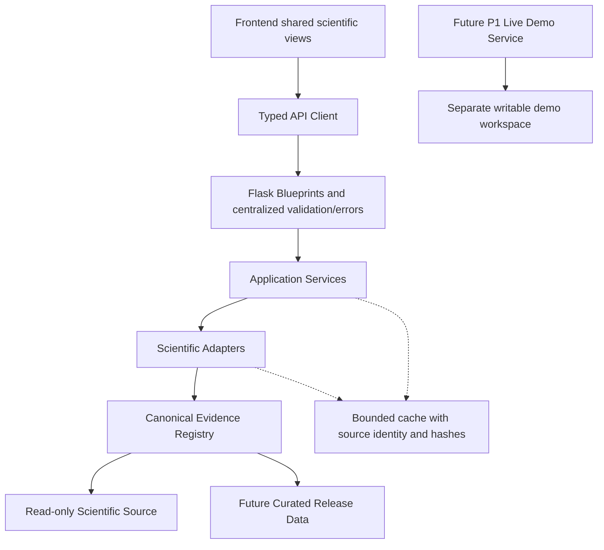

# ShockPath V1 — System Architecture

版本：`1.0.1` · Phase 4 · 2026-10-01（Asia/Shanghai）。状态：**FROZEN**。人工审核：`PHASE4_REVIEW=PASS_WITH_MINOR_FIXES`；三项 patch-level clarification 完成并正式冻结。本文件与 [05_DATA_SCHEMA.md](05_DATA_SCHEMA.md)、[06_API_CONTRACT.md](06_API_CONTRACT.md) 联合冻结；PASS 不表示实现、科学重新认证或正式发布。

## 上游与优先级

完整阅读：`docs/00_PROJECT_SCOPE.md`、`D:\比赛\数媒\data\01_DATA_ASSET_INVENTORY.md`、`mind_design/02_ShockPath_PRD_V1.md`、`docs/03_USER_FLOW_AND_IA.md`。完整解析既有 `data_asset_inventory.json`（2337 记录），读取 `DATA_INVENTORY_FREEZE.json` 并按相关资产核查字段；未重新盘点。正式 inventory 使用比赛目录，软件 `data/` 副本不替代它。

执行最新用户要求：三文档编号为 04 Architecture / 05 Schema / 06 API；软件根为 `D:\code_project\CFD_visiblesystem`；后端正式选择 **Flask + Python**。早期 Scope 的科研目录项目根与 PRD 旧文件编号不据此改写。IA 已冻结，保持四导航、九模板、五页首切片。用户于本阶段明确追加“新增账号注册设计”：本组三文档增加MySQL + QQ邮件验证码账号扩展；这是设计范围补充，不静默修改原P0/上游，不成为Case8 Replay前置依赖。详细边界见第23节。

# 1. Architecture Goals

优先级：scientific correctness → traceability → schema consistency → frontend/backend contract stability → functional simplicity → performance → UI convenience。架构服务真实离散回放与逐结果证据，适合一人/小团队、Windows 本地比赛和以后视觉优化。

`Scientific Source Format → Adapter → Canonical Application Model → API DTO → Frontend` 是唯一正式数值链路。Explore 为 curated state，Lab 为 full supported controls；二者使用相同 scientific views、结果 identity、API 与 evidence。

# 2. Constraints

本阶段仅新增本组三份 Markdown。禁止建工程、安装包、创建数据库/测试/adapter、复制数据、生成 release bundle、运行 CFD、修改科研文件与上游文档。

| 实验 | 必须继承的能力边界 |
| --- | --- |
| Case8 | A/B/C/D，每配置1912 accepted-step scalar records、六真实流场/endpoint face快照；无1912全场、无全部stage空间场。D_u累计native-face仅来自既有冻结DIAGNOSTIC_RERUN |
| Gate | Acoustic/Pressure/Ungated；32×128 cell累计图，STATIC展示、TRAJECTORY_INTEGRATED积累；无map时间播放/自由q |
| Closure | B_u CFL=.05；D_u .2/.1/.05/.025；PER_STAGE与PER_STEP分开 |
| Spectrum | 四q（0/.132/.264/.396）×17ell=68；每block512 eigenvalues、top32左右vectors；无serialized矩阵 |
| Fig13 | mode1/4/8/12 × q0/.396 × epsilon1e-4/1e-5/1e-6=24 runs；每run33投影幅值点；无CFD空间movie |
| Cylinder | A/B/D；9757 scalar records、五instantaneous face snapshots、16累计角扇区、固定累计front band；无累计二维Pi_at |
| Near-1D | 五epsilon scan不进入正式numerical registry；机制可有显式schematic |

禁止缺失变零、补帧/参数插值、合并mask/测度/时间粒度、把history当production、把AVAILABLE_UNVERIFIED升级verified。不同HF/width/localization不统一排名。

# 3. Technology Decision

## 3.1 Frontend comparison and decision

| 维度 | Vue 3 + TypeScript + Vite | React + TypeScript + Vite |
| --- | --- | --- |
| 当前规模 | 九模板、多个科学view，SFC将控件、展示与生命周期集中，便于小团队审查 | 组件组合同样足够，但需要自行约定更多状态和组件组织 |
| 科学可视化 | 通过ref/lifecycle持有ECharts和Canvas实例；无需响应式追踪每个数组元素 | ref/effect也能完成；需要明确effect依赖和实例清理 |
| 状态复杂度 | Router + Pinia分管路由与会话；Vue Query管理服务端结果 | Router + store + query亦可；没有需求要求React专属生态 |
| Codex开发/维护 | 统一Composition API与script setup，缩小风格分歧 | 同样可维护，但此项目不因React流行而新增选择负担 |
| 竞赛时间 | 简单模板、少量依赖和明确文件职责适合先跑Case8 | 可实现相同目标，没有迁移或旧React工程的收益 |

**RECOMMENDED_FRONTEND_STACK = Vue 3 + TypeScript + Vite + Vue Router**。这是基于项目职责和维护约束的工程判断，不声称某框架天然更科学或Codex生成速度必然更快。Vue的组件/响应式/Composition API与React的组件/state能力参考其官方文档：[Vue](https://vuejs.org/guide/introduction.html)、[React](https://react.dev/learn)；本仓库当前只有文档，无现有前端需要迁移。

## 3.2 Backend: Flask is sufficient

**BACKEND_STACK = Flask + Python**，推荐Python 3.12、Flask 3.1系列、Pydantic 2、NumPy、标准库CSV/JSON、Waitress（Windows现场WSGI）。具体patch与依赖锁定在实施阶段完成。

V1是单机read-heavy Replay：文件/CSV/NPY/NPZ读取、有限组合检索、同步计算型格式转换，不需要大规模长连接、solver任务队列或数据库交易才能展示。Flask可完整承载这些需求，用户熟悉Flask还能降低维护成本。FastAPI是可行备选，其自动OpenAPI优势不构成更换用户选定框架的理由；本方案不保留双后端。

| 保证项 | Flask设计约束 |
| --- | --- |
| Data Schema validation | Pydantic规范models；adapter出口验证canonical；Blueprint入口验证路径/query；序列化前验证DTO与ApiEnvelope；禁止直接jsonify未经验证的CSV/NumPy对象 |
| API consistency | 一个operation catalog绑定method/path、operation_id、request/response model、errors；运行时路由与目录差异由后续测试拒绝；前端type从同一OpenAPI生成 |
| 可维护自动文档 | Pydantic生成JSON Schema；operation catalog组合OpenAPI 3.1，转换$defs引用到components并校验；`GET /api/v1/openapi.json`与本地Swagger UI `/api/docs`；描述/例子与operation同处，避免第二套手抄字段 |
| Scientific errors | app级统一handler将typed domain errors映射06的HTTP/status/code；404/405也统一覆盖API路径；没有把所有错误塞500 |
| Testability | application factory注入registry/source/cache；service与adapter不依赖Flask request；pytest + Flask test client +独立schema/科学回归 |

这些是后续必须实现的项目能力，**Flask不会自动替项目校验Pydantic或生成OpenAPI**。官方支持基础：[Blueprint](https://flask.palletsprojects.com/en/stable/blueprints/)、[error handling](https://flask.palletsprojects.com/en/stable/errorhandling/)、[Flask tests](https://flask.palletsprojects.com/en/stable/testing/)、[Pydantic JSON Schema](https://docs.pydantic.dev/latest/concepts/json_schema/)。未知API URL的404/405需app级handler，不能仅依赖Blueprint handler。

## 3.3 Visualization comparison and choice

| 方案 | 适合 | V1决定 |
| --- | --- | --- |
| ECharts | 折线、bar、scatter、普通heatmap、选点与共享轴 | 默认chart库；entropy/metrics/alpha/amplitude/sector使用它 |
| Plotly | 科学散点、复杂subplot、可选3D | 不同时引入；当前功能ECharts可覆盖，未来有明确缺口再评估 |
| 原生Canvas 2D / WebGL | 按真实网格渲染cell/face、坐标与mask覆盖 | Canvas 2D作为field renderer；WebGL仅后续性能实测有需要时替换渲染内核 |
| vtk.js | 较复杂几何/体数据/3D科学pipeline | 不列V1依赖；普通二维数组无需VTK数据模型 |

普通折线/bar/scatter/规则统计heatmap用ECharts；CFD structured cell/face field用Canvas 2D；Cylinder native face依据真实curvilinear坐标绘制（无坐标则明确MISSING，不按均匀极坐标猜）。复杂eigenmode先显示已存real/magnitude primitive profile，用ECharts；已有二维分量才用同一Canvas renderer。complex拆real/imag由adapter，组件投影/phase/magnitude属于显式显示转换，不赋新验证状态。

Canvas用最近邻cell/face着色，保留原始值tooltip与mask；不做平滑补数据。x/y-face可分别呈现，不把不重合格点强行当cell。Gate比较共享范围与色标来自三张当前真实map；渲染统计仅显示用途。库能力参考：[ECharts](https://echarts.apache.org/en/feature.html)、[Plotly](https://plotly.com/javascript/)、[vtk.js](https://kitware.github.io/vtk-js/docs/)。

```text
FRONTEND_STACK=Vue 3 + TypeScript + Vite + Vue Router
BACKEND_STACK=Flask + Python
CHART_STACK=Apache ECharts
FIELD_RENDER_STACK=Native Canvas 2D
STATE_MANAGEMENT=URL/Vue Router + Pinia + TanStack Vue Query
API_CLIENT=openapi-typescript types + openapi-fetch
SCHEMA_VALIDATION=Pydantic 2
API_DOCUMENTATION=OpenAPI 3.1 from operation catalog and Pydantic JSON Schema + local Swagger UI
TEST_STACK=pytest + Flask test client + NumPy regression + Vitest + Vue Test Utils + Playwright
```

# 4. High-Level Architecture

```text
Frontend: Entry + shared system shell + shared scientific views
  ↓ API Client (typed request, abort, query identity)
Flask Backend API Layer (Blueprints, validation, centralized errors)
  ↓ Application Service Layer (capability, composition, authorization boundary)
  ↓ Scientific Adapter Layer (source semantics → canonical models)
  ↓ Canonical Evidence Registry (explicit selected assets, identity/hash/semantics)
  ↓ Read-only Scientific Source (SCIENTIFIC_DATA_ROOT)

Future alternate source: Curated Release Data → same registry/adapter/service/API
Cache: side cache in software workspace; preserves source and verification context
P1 Live Demo: separate writable workspace; never writes frozen source/registry
```



Registry是查找/身份控制边界，不是把文件全文存入数据库的pipeline节点。adapter先通过registry取得受控source descriptor，再只读打开对应文件。

# 5. Layer Responsibilities

| 层 | 能做 | 不能做 |
| --- | --- | --- |
| Frontend | 合法选择、图形显示、双时间提示、单位显示换算、evidence跳转 | 源路径读取、科学积分/拟合/新q插值、status提升、生产值硬编码 |
| API | Blueprint路由、请求/响应校验、DTO投影、HTTP与operation文档 | 解释原始列名、直接拼科研路径、把load error变空成功 |
| Service | registry组合验证、nearest snapshot、cross-flow组合、预算/summary调度 | 修改scientific source、发明未保存场、隐式改变mask |
| Adapter | 解析格式、映射列/坐标/complex、保留测度/来源、规范化原有数据 | 运行solver、写源、从图反推值、恢复未知源码、认证新科学主张 |
| Registry | 确定canonical选择、asset/result/evidence/definition/mask关系、支持组合 | 自动全盘扫描、按文件名择最新、用副本替换原记录 |
| Scientific Source | 原有科学证据/冻结数据与方法说明 | 被服务写入、改freeze、move/delete/rename |
| Cache | 有限只读解析结果；写入仅软件cache目录 | 丢弃hash/status、跨revision混用、漂移后继续以旧verified提供数据 |
| Release Bundle | 后续授权精选离线数据、hash/manifest/release identity | 本阶段生成、夹带全部2337资产、将拷贝过程当验证 |

# 6. Proposed Repository Structure

以下仅设计，**不创建这些目录/文件**；现有docs/mind_design位置保持。

```text
D:\code_project\CFD_visiblesystem
  frontend/
    src/
      pages/          # 九模板；首切片五模板
      components/     # scientific container/status/evidence link
      scientific/     # Entropy/Allocation/Spectrum/Validation等共享view
      services/       # API client，generated contract types
      stores/         # Pinia会话状态；query独立
      types/          # 同源generated DTO types，不手抄科学字段
  backend/
    api/              # Blueprint、operation catalog、DTO validation
    services/         # registry/result/evidence/comparison services
    adapters/         # 七个轻量adapter
    models/           # canonical Pydantic models
    schemas/          # request/transport/projection和schema export
    registry/         # selected registry配置读取；不是数据库
    core/             # app factory/settings/errors/source guard/cache
  docs/               # 00/03及本轮04/05/06
  mind_design/        # 保留现有PRD
  config/             # 无secret模板、canonical selection定义
  scripts/            # 后续schema/docs export与launch
  tests/              # 后续contract/scientific/UI/e2e
  release_data/       # 未来授权精选；本阶段不存在
  .env                # 未来本机secret；不入版本库/发布包
  README.md           # 未来启动/联调说明
```

# 7. Experiment Adapter Architecture

用小型protocol/函数集合表达base scientific adapter，不建设复杂继承树。公共接口语义：`describe_experiment`、`list_configs`、`describe_capabilities`、`list_results`、`load_result(result_id)`；返回05的typed model/typed error。特定read方法可由薄函数补充；不要求每adapter实现无意义load_spectrum。

| Adapter / Service owner | 规范结构 | 输入与关键责任 |
| --- | --- | --- |
| Case8Adapter / Case8Service | Experiment、FieldSnapshot、ScalarSeries/EntropyHistory、Metric、AllocationResult | corrected真实flow与J2B face/history来源分别记录；D_u map另加DIAGNOSTIC_RERUN |
| GateAdapter / GateService | GateRegistry、AllocationField/Summary、GateComparison | 三冻结cell map、matched_qat、analysis；sum不额外乘measure |
| EntropyClosureAdapter / ClosureService | EntropyClosureRun、stage/step ScalarSeries、RefinementSummary | 五已存组合；stage与step分别映射，保留R_time定义 |
| SpectrumAdapter / SpectrumService | SpectrumDataset/Record、Eigenmode | 68 blocks，512 values/top32 vectors、baseline、mask、normalization；不读取不存在矩阵 |
| ModalValidationAdapter / ValidationService | ModalValidationRun/Summary/History | 24×33；原summary的fraction与fit window；关联同一spectral result |
| CylinderAdapter / CylinderService | FieldSnapshot、EntropyHistory、Metric、sector AllocationResult、band Summary | interior-only、真实face几何、五帧、16扇区；不制造累计2D场 |
| EvidenceAdapter / EvidenceService | EvidenceRecord、SourceAsset、Provenance | inventory/既有freeze证据链与current-source observation；不修manifest |
| 无新科学adapter / ComparisonService | CrossFlowComparison | 合成两侧已加载typed结果；不合并定义、不建ranking |
| RegistryService / ContentService | ProjectInfo、ScenePreset、MechanismContent、ExperimentCapability | 受控metadata/示意内容与解释依据，均不产生数值实验 |

Adapter负责原字段语义和可信转换；service负责请求目标与支持组合、局部失败组合；frontend只消费规范结构。后续若累计某step增量，必须adapter显式processing lineage、回归核验，不由frontend临时相加当正式结果。

adapter还承担显式索引/元数据映射：Case8 history原source_step=0对应完成第1步endpoint，canonical保留source_step_index并映射completed step；Closure原stage1/2/3映射canonical0/1/2。Closure部分inventory的CFL从目录名误解析为.005，按冻结报告/协议核定.05并保留METADATA_CORRECTION processing，不改上游。两项规则在05/06共同冻结，前端不得自行修正。

# 8. Capability-driven Experiment Architecture

experiment registry列六个稳定identity：`case8`、`gate`、`entropy-closure`、`spectrum`、`modal-validation`、`cylinder`；Near-1D不注册，Spectrum不归Case8。capability registry是可用科学任务与组合约束，不是前端路由白名单或软件交付进度。

05定义`ExperimentCapability`含family status、per-config status、controls、limitations、tab policy；06提供registry接口。Case8 Allocation family=PARTIAL；D_u SUPPORTED；A/B/C MISSING。Cylinder sector/band=SUPPORTED，full cumulative2D=MISSING；Spectrum task=UNSUPPORTED。Closure refinement不叫modal validation。

P06统一ExperimentDetail壳，以registry决定：全族无任务隐藏tab且Overview列原因；当前config缺失则保留禁用；runtime加载失败保留tab及错误；非法深链显示解释，不静默换数据。共享具体view不意味着所有数组共用同一field类型。

系统四导航：Home / Explore / Lab / Evidence。九页面：P01 Entry、P02 Home、P03 Explore、P04 Lab、P05 Mechanism、P06 Experiment Detail、P07 Cross-flow、P08 Evidence Center、P09 Evidence Detail。首切片只交付P01/P02/P04/P06 Case8/P09；目录只开放已联通Case8，其他为delivery状态PLANNED，不标科学MISSING。

# 9. State Management Strategy

SNAPSHOT_INDEX_CONVENTION = USER_VISIBLE_1_BASED_RECORDED_INDEX。snapshot_index 始终严格 1-based（Case8 1…6，Cylinder 1…5），不得为0；初始保存帧是 snapshot_index=1、step_index=0。step_index 表示 completed accepted steps，source_step_index 保留原编号；不重编号科研文件或改变数据。

| 状态层 | 内容 | Owner |
| --- | --- | --- |
| URL-restorable | release/revision、experiment、config、tab、snapshot_id、field_id、scalar step、gate、q_at、ell、eigen rank/side/component、validation run、scene、双侧compare config、evidence_id | Router；URL是已提交选择的来源 |
| temporary UI | hover、播放进度、tooltip、panel open、拖动中游标、缩放/色标临时设置、return context | component/Pinia；不会制造科研值 |
| scientific loaded | metadata、result、array、status、evidence refs、source hashes及request identity | Vue Query；大数组shallow/非深响应式 |

建议页面路径：`/` Entry、`/home`、`/explore?scene=5`、`/lab`、`/lab/mechanism`、`/lab/experiments/:experiment_id`、`/lab/compare`、`/evidence`、`/evidence/:evidence_id`。路径是frontend navigation，不替代06 API。深链绕过Entry，刷新由后端静态SPA fallback（API路径绝不fallback到HTML）。

scalar/snapshot独立。最近帧规则：同config中最小`abs(snapshot physical_time − scalar physical_time)`；**严格相等的距离取更早physical_time，再取更小snapshot_index**，不引入浮点容差造假同距。scalar time来自原日志endpoint；stage physical time缺来源时UNKNOWN，不推算为单调endpoint序列。service返回SnapshotAlignment，显示selected/displayed两个真实时刻及signed time delta。

换config保留tab/field意图与scalar目标physical_time，按新日志最近真实endpoint选scalar（同距早时/小step）；再按上述规则选snapshot，并显式说明重新匹配。独立Flow选择优先相同真实snapshot序号，但始终换为新config identity和实际时间；不能跨config沿用旧result。已有snapshot明确固定时可标`PINNED`，否则`NEAREST_RECORDED`；两者状态URL可恢复。

query key含registry revision/source fingerprint/experiment/config/result/semantic/合法selectors。切换取消旧request或以generation拒绝过期response；旧数据不能套新标题。连续drag用replace，已提交config/tab/scene用push。return context只接受同源已知页面与合法selectors，无历史时回稳定父级；不接受任意外部redirect。

# 10. Data Loading Strategy

05的metadata通过ArrayRef引用受控array identity；06 ARRAY01按result_id/array_id取全精度扁平JSON。ResultArrayService调度拥有该result的同一adapter；不构造任意NPZ成员读取API。坐标/bin边界拥有独立semantic/unit/header，不能继承entropy通道单位。

先ProjectInfo +轻量experiment/capabilities；进入P06后configs/metadata，当前tab才取history/metrics/snapshot。Flow列表先列真实step/time/fields，再取当前field。预取下一真实帧可选，最多当前配置相邻一帧，不能启动全配置全资产扫描。

Spectrum仅进入相关tab时取68摘要/所选四q曲线；点mode才取当前block的512 eigenvalues；展开Modes才取单rank/side的vector。禁止把4×17×512×32向量容器整体传浏览器。Fig13只取当前run33点；Evidence Quick View用短ref，P09才取完整chain。Gate三图比较才加载三map，static无time请求。

# 11. Cache Strategy

V1进程内有界LRU，不引入Redis。metadata（小、revision敏感）、parsed CSV（按资产+hash+adapter/schema version）、NPZ member/result（按asset/hash/member/selectors）各自设byte budget。无需落盘parsed数据；未来持久cache仅软件cache根。

entry保留asset IDs、recorded/observed data hashes、method/source drift、verification basis/observed_at、processing与limitations。request读取前按registry已知文件核查身份/当前hash（可按一次稳定stat指纹缓存hash；检测到文件变化即失效重新hash，不能据mtime单独认证）。in-flight前后stat/identity变化拒绝当前结果。启动不全盘扫描或hash2337资产。

数据hash漂移：旧frozen descriptor仍留Evidence，但数值路径返回SOURCE_DATA_DRIFT，不继续发旧verified缓存。源码漂移且数据hash未变：允许读取原已核验结果，保留source_drift与复现限制，不能承诺当前代码精确重跑。verification新观察改变也改变ETag/cache key；ETag不是冻结认证。

frontend query cache保留完整结果header和evidence refs，metadata适度stale、不可变revision数据可长缓存；release切换不混cache。尚未存在release_id时用registry_revision/data_revision，不虚构正式release。

# 12. Error Isolation

page层：Project/experiment identity失效显示fallback；静态Entry和Home导航可用。tab层：history错误不清Flow；plot层：一个field/metric失败不清其它chart。保留当前选择、错误code/目标/retryability/evidence，重试只重取失败query。

scientific unsupported/missing不是异常堆栈；service composition将已存子结果保留，局部错误用05 ResourceSlot表达。loading属UI，不写scientific verification。全局异常handler日志带request_id，不把路径/secret/堆栈传浏览器。

# 13. Evidence Architecture

EvidenceRecord从同registry内嵌result_contexts（仅header）、config、definitions和masks，保证P09独立深链可审查unit/time/scope/grid/处理依据；不要求用户先访问结果图，不加载全量科学数组。

`result identity → source assets → method → config → processing → verification → hashes → limitations`。每个plot有自身result/evidence refs；多来源对象列每个field直接来源与同一composite链，不用一个frozen徽章覆盖mixed assets。

P09首切片就实现，P08/侧面板可后补；同一EvidenceDetailContent复用。Canonical内部可存absolute source path用于只读locator；public DTO仅asset_id/source_id/source_display/relative origin说明，不给file://或任意下载path。

哈希分开：method_hash、recorded/current source hash（逐依赖）、原始data hash、派生processing hash（存在才给）、payload ETag。UNKNOWN不互相替代。Evidence可显示AVAILABLE_UNVERIFIED/LEGACY/SUPERSEDED/缺口，正式数值路径排除它们。

# 14. Read-only Security

backend用`SCIENTIFIC_DATA_ROOT`解析registry中的受控相对路径；resolve后必须在允许根内，拒绝路径穿越、根外链接与客户端路径输入。文件仅rb/r读；NPY/NPZ不启用pickle/object dtype。不执行科研脚本、导入有运行副作用的solver入口。

未来启动账户对科研根采用Windows只读ACL（应用层guard与OS权限并用），software/cache/log/demo根独立可写。禁止write/delete/rename/overwrite/modify freeze。科研root不挂Flask static目录，不把根全盘通过文件API发布。本阶段不更改ACL或源文件。

# 15. Development Environment

Python基线3.12，NumPy/Pydantic/Flask选兼容稳定版、精确锁版本在实施时完成；生产环境独立conda/venv，不能直接修改原科研环境。用户绘图参考环境是conda `analysis-env`；本轮不绘图、不安装。Windows终端默认pwsh 7。

Node推荐24 LTS；Vite官方当前说明要求Node20.19+/22.12+，实施时校验所选Vite版本兼容并锁定，不用竞赛现场浮动latest。[Node releases](https://nodejs.org/en/about/previous-releases)、[Vite guide](https://vite.dev/guide/)。

| 配置名 | 设计意义 / 默认 |
| --- | --- |
| SCIENTIFIC_DATA_ROOT | 本机科研根，仅部署配置引用；业务代码不硬编码盘符 |
| INVENTORY_PATH | 用户指定正式Phase1 JSON索引位置 |
| CANONICAL_REGISTRY_PATH | 后续软件目录显式selected registry，独立revision |
| DATA_SOURCE_MODE | SCIENTIFIC_ROOT或未来RELEASE_BUNDLE；不能缺失时自动换源 |
| RELEASE_DATA_ROOT / RELEASE_ID | 未来bundle；未建立时不启用 |
| CACHE_ROOT / DEMO_WORKSPACE_ROOT | 软件可写根；不得位于科研根 |
| API_HOST / API_PORT | 默认loopback、例如127.0.0.1:5000 |
| ENABLE_LIVE_DEMO / ENABLE_ACCOUNTS | 默认false；Live P1与本轮已设计的账号扩展独立启用 |
| DATABASE_URL | 未来MySQL+PyMySQL；模板`mysql+pymysql://<user>:<password>@127.0.0.1:3308/<database>`，库名未提供 |
| MAIL_SERVER / MAIL_PORT / MAIL_USE_SSL | QQ SMTP：smtp.qq.com / 465 / true，未来服务端配置 |
| MAIL_USERNAME / MAIL_PASSWORD | 由环境读取账号与SMTP授权码；不写本文、frontend env、日志、contract或发布包 |
| MAIL_DEFAULT_SENDER | 未来服务端默认取MAIL_USERNAME |
| OTP_HASH_KEY / SECRET_KEY | 验证码HMAC与Flask会话/CSRF签名秘密；由环境读取，不写文档/公开DTO |

用户提供的本机连接信息只用于此配置边界设计，**本阶段未创建.env或持久化secret**。MySQL和SMTP不承担科学数据权威registry；关闭/故障时核心Replay仍可离线。账号扩展采用SQLAlchemy 2 + PyMySQL；缺库名不能宣称连接已可用。[SQLAlchemy MySQL/PyMySQL](https://docs.sqlalchemy.org/en/20/dialects/mysql.html)。账号实体与接口在05/06独立章节定义，不与科学结果/验证状态混合。

# 16. Local Development

未来Vue/Vite dev server（建议5173）代理`/api`至Flask dev server（建议5000）；frontend相对API base，端口可配。开发仅loopback，若不用proxy则CORS只允许明确dev origin。Flask debug/reloader仅开发，scientific root依旧只读。

合同先行：审核本组三文档 → 后续建立共享Pydantic/request/DTO与operation catalog → 导出OpenAPI/types → frontend可用schema-valid MOCK fixture、backend并行真实adapter → 同operation逐步联调。mock必须`data_origin=MOCK`、verification=NOT_APPLICABLE、evidence指mock说明，不在正式图混用；科学结果值可合成仅用于UI测试、显著标MOCK；本文占位符不是可执行fixture。

# 17. Deployment Strategy

| 选项 | 优点 | 限制 / 决定 |
| --- | --- | --- |
| 纯本地开发双server | 简单联调 | 仅开发；dev server不能充现场生产服务 |
| 单机打包本地浏览器 | 静态frontend + Flask/Waitress同源服务、已授权精选本地数据；拔网线可用 | **推荐竞赛发布形态**；先以可解压目录/本机runtime实现，不强制单exe |
| 局域网单机服务 | 多设备访问同一结果 | 需授权、防火墙与bind配置；不是离线单机唯一入口 |
| 云部署 | 分享方便 | 许可、上传/成本与网络依赖；V1后续可选，不作竞赛主线 |

未来现场用生产WSGI承载Flask，静态dist与已授权bundle同源；所有JS/font/chart/docs资源本地，无CDN；loopback浏览器即可访问。Offline-capable指本机服务和本机数据可用，**不表示浏览器静态HTML可直接读科研盘**；不需要service worker缓存全集。首次冷启动、拔网线与换机启动都要后续验收。Flask官方强调生产不用开发server：[Deployment](https://flask.palletsprojects.com/en/stable/deploying/)。

# 18. Live Demo Isolation

Frozen Replay Workspace与Live Demo Workspace使用不同roots、registry namespace、result/data_origin、默认路由和cache。Live属P1；目前无POST计算API、无任务队列设计。未来live不能自动成为FROZEN_VERIFIED；原结果与冻结manifest不可写，晋升证据需独立真实审查。Live/账号服务异常不能阻塞Replay，也不要求SMTP联网才能进入系统。

# 19. Testing Architecture

| 后续测试层 | 关键验证 |
| --- | --- |
| adapter | 原列/member→semantic；Gate sum无二次measure；Case8 face dy/dx；Cylinder16sector/interior；complex排序/normalization |
| schema | strict types、UNKNOWN/MISSING/N/A、union与axes/shape/mask/units、排除额外字段 |
| contract | Flask test client；operation catalog/路由/OpenAPI/types一致；每状态码模型、404/405 JSON、响应校验 |
| scientific regression | Case8四config×六actual time/1912rows；terminal/source数值；68blocks/512/32；Fig13 24×33；Cylinder3×5/9757 |
| provenance | 来源hash/status、drift、DIAGNOSTIC_RERUN、副本与canonical选择不漂移 |
| frontend smoke | 五模板路由、控件按capability、MOCK标识、局部错误与过期请求 |
| e2e | Entry→Home→Lab→Case8→entropy/metrics→Evidence→返回；refresh/deep-link/断网现场Replay |

成功不止HTTP200；schema/identity/scientific/provenance/semantic/UI-state六类均列为DoD。不运行新CFD。测试临时副本只在将来软件test workspace，本阶段不创建测试。

# 20. Architecture Decisions

| ADR | 冻结设计决定 | 影响 |
| --- | --- | --- |
| ARCH-001 | Frontend=Vue3/TS/Vite | 单一SFC/Composition API风格 |
| ARCH-002 | Backend=Flask + Python | Blueprint + Pydantic + operation catalog；不切回FastAPI |
| ARCH-003 | Scientific root READ_ONLY | registry locator与文件guard双边界 |
| ARCH-004 | HYBRID_SHARED_SCIENTIFIC_WORKSPACE | Explore/Lab共享view与结果 |
| ARCH-005 | P06 CAPABILITY_DRIVEN | 六experiment identity，同模板不同任务 |
| ARCH-006 | Canonical schema先于DTO | 原CSV/NPZ不是API格式 |
| ARCH-007 | HTTP GET /api/v1主导 | typed errors、局部partial、可追溯 |
| ARCH-008 | ECharts + Native Canvas2D | 不引入vtk/Plotly/WebGL多重依赖 |
| ARCH-009 | Metadata first / on demand | 不将2337assets传浏览器 |
| ARCH-010 | Bounded process cache | fingerprint/verification不能丢失 |
| ARCH-011 | Cross-flow backend composite | 两侧定义/provenance独立，无统一ranking |
| ARCH-012 | Compressed JSON + typed flat arrays | 小中数组先简单；未来binary替换见06 |
| ARCH-013 | Evidence从首切片存在 | 每plot→P09 |
| ARCH-014 | Single-machine offline demo | 同源WSGI/static、本地数据，无CDN |
| ARCH-015 | Live P1独立workspace | 不自动冻结/污染Replay |
| ARCH-016 | Contract-first parallel frontend/backend | 同Pydantic导出schema/types，MOCK显式 |
| ARCH-017 | 用户追加账号注册技术设计 | MySQL+PyMySQL、QQ邮箱验证码；不为科学Replay加依赖，不在Phase4实现 |

# 21. Risks

最大风险是科学语义在方便的图形接口中被弱化；05定义具体semantic/measure/mask，06不开放无限参数。其次是源码hash漂移、Case8混合verification、许可证未知；Evidence逐项表达，不承诺重新执行当前源码复现。Flask自建validation/docs可能漏操作，operation catalog和response tests是必需项。NPZ解压整个容器增加内存，adapter仅选请求member并限制cache预算。模型单位无SI映射；Canvas复杂Cylinder坐标缺失时只能显示已明确数据，不能猜网格。

# 22. OPEN_QUESTIONS

| ID | 非阻塞项 | 缺答案时决定 / 后续门槛 |
| --- | --- | --- |
| Q1 | 历史driver/observer精确源码归档 | 保留drift，不承诺当前代码精确执行；可执行复现前核实 |
| Q2 | SI映射和竞赛数据分发许可 | model units/UNKNOWN；对外bundle前解决许可 |
| Q3 | Cylinder native face几何/primitive展示字段 | 只用已存面数据/坐标，缺字段显示MISSING |
| Q4 | 首版硬件内存与性能预算 | 当前全精度小中数组按需；后续实测不默认downsample |
| Q5 | MySQL库名及账号扩展实际交付阶段 | 本轮已设计注册；未提供库名、未连接；不影响Replay/Phase4 PASS |

# 23. Account Registration Extension — 用户追加设计

Account Extension 已设计并保留 MySQL、QQ email、OTP、session、CSRF、Account Blueprint 和 AUTH 契约；交付优先级正式冻结：

```text
ACCOUNT_EXTENSION_PRIORITY=P1_NON_BLOCKING
ACCOUNT_EXTENSION_BLOCKS_P0=NO
ACCOUNT_EXTENSION_BLOCKS_CASE8_SLICE=NO
ENABLE_ACCOUNTS_DEFAULT=false
```

账号不属于 P0 scientific core 或 Case8 Functional Vertical Slice DoD，Account DB/API 不作为 Phase 5 首批必做项。MySQL、QQ SMTP 或 Account Service 不可用时，Entry、Home、Lab、Case8 Replay、Scientific API、Evidence、Explore 与核心 Replay 仍支持 Anonymous Replay。首阶段不优先实现 registration/email code/login/session；后续账号切片仍遵守本文现有安全模型。

## 23.1 IA and owners

在Entry或系统壳的次要“注册/登录”操作打开同一AccountDialog，不新增一级导航或可导航页面，不改变“进入系统→Home”、九模板或五页Case8切片。注册只确认账号身份，不授予科学写权限，浏览Replay不强制登录。`ENABLE_ACCOUNTS=false`时入口显示当前未启用；SMTP断网提示账号操作不可用，Replay不受影响。

Account Blueprint → AccountService → AccountRepository（SQLAlchemy/PyMySQL/MySQL）和MailService（标准库SMTP_SSL）。这些不经过Scientific Adapter/Scientific Source，不把users/验证码存科学registry。其request/response也由Pydantic、operation catalog和central handler管理。app factory延迟初始化账号依赖；MySQL不可用仅令账号operation返回503，不令公共Replay启动失败。

## 23.2 Flow and persistence

QQ邮箱地址输入（服务策略限制@qq.com域） → 请求六位数字验证码 → 发送到该收件QQ邮箱 → 用户提交challenge_id、code、email、display_name、password → 原子校验并创建账号 → 返回账号信息，用户可登录。发送账户取MAIL_USERNAME，SMTP授权码取MAIL_PASSWORD；发件账户不是注册账号的固定收件人。

采用MySQL InnoDB三张业务表：users、email_verification_challenges、auth_sessions；字段与索引见05。额外account_rate_limits用于跨请求/重启限速，不引入Redis。数据库端口3308继承用户配置，库名待定。不存在把科学数组迁入MySQL的设计。

验证码设计默认TTL=600s、单challenge最大5次错误尝试、同邮箱发送间隔60s、邮箱每小时最多5次/IP每小时最多20次；login每IP每15分钟最多20次。规则参数可配置，失败尝试与限速原子更新。新challenge发送成功后取代旧active challenge；SMTP发送失败不激活新code，旧未过期code仍保留。code仅HMAC-SHA256摘要（绑定challenge/email/purpose和OTP_HASH_KEY）；不明文存储或日志记录。code由cryptographically secure RNG生成；单次使用。

不保持DB事务等待SMTP网络：先原子预留限速/建立PENDING_SEND，再限时SMTP_SSL发送，成功后短事务激活；失败标SEND_FAILED。验证码接口成功仅表示SMTP已接受提交，不保证收件箱送达；不设计后台队列。超时后的不确定发送状态不激活challenge，邮件提示以最后成功请求为准。MailService可注入fake，后续测试不发送真实邮件。

注册锁定challenge行，核对email/purpose/state/expiry/attempts/code，在同事务创建唯一email账号并consume challenge；并发两次注册最多一次成功。失败尝试计数必须commit（不能因抛异常被整体rollback），到5次标LOCKED；成功消费与insert同时提交，DB失败不消费。email规范化trim、QQ域名小写、local-part按既定形式保留；不擅自移除点/加号。

password至少12最多128字符（不静默截断），用Werkzeug scrypt自带salt存password_hash；不保存/返回password。session使用随机opaque token，DB仅token摘要，cookie HttpOnly/SameSite=Lax，联网部署Secure+HTTPS；本机loopback HTTP的Secure配置例外明确限local demo。POST账号接口校验同源Origin和CSRF token（包括未登录表单）；CSRF获取接口见06。session固定24小时、logout吊销，不做JWT/refresh-token多层系统。官方基础：[Werkzeug password hashing](https://werkzeug.palletsprojects.com/en/stable/utils/#werkzeug.security.generate_password_hash)、[SMTP_SSL](https://docs.python.org/3/library/smtplib.html)、[Flask web security](https://flask.palletsprojects.com/en/stable/web-security/)、[InnoDB locking](https://dev.mysql.com/doc/refman/8.4/en/innodb-locking.html)。

注册成功后再登录；验证码按同邮箱generation防乱序SMTP回执激活旧码。OTP_HASH_KEY、Flask会话/CSRF签名SECRET_KEY由环境提供，公开DTO和日志不回显request password/code或Pydantic raw input。账号app factory与科学服务独立依赖初始化。

SMTP_SSL显式使用验证证书/主机名的默认TLS context；SMTP connect/read设有限超时，服务端日志按request_id记录受控错误原因而不输出授权码。邮箱格式允许有效ASCII local part与@qq.com域，验证码确认收件地址；不把发件邮箱作为所有用户的注册邮箱。

## 23.3 Error and tests

账号错误使用06统一ErrorBody但domain=ACCOUNT，code涵盖INVALID_EMAIL、INVALID_OR_EXPIRED_CODE、ACCOUNT_ALREADY_EXISTS、RATE_LIMITED、INVALID_CREDENTIALS、UNAUTHENTICATED、CSRF_FAILED、MAIL_SERVICE_UNAVAILABLE、ACCOUNT_STORE_UNAVAILABLE。不能给验证码贴FROZEN_VERIFIED，不能用scientific MISSING解释数据库故障。

后续测试：QQ地址校验、邮件发给用户输入的收件人而非固定sender、SMTP_SSL配置、过期/错误次数/重发冷却、旧码失效、并发consume/唯一email、密码hash与公共DTO排除secret、session/cookie/CSRF、MySQL/SMTP故障不影响Replay。单元test用fake repository/mail/clock；事务并发integration test用隔离MySQL测试库，不能用SQLite模拟MySQL行锁。Phase4不建表/不连接/不发信/不创建账号，账号交付不会加入Case8首切片DoD。

nearest mapping同距规则已在第9节解决，不再列未决。缺失Near-1D/raw与Cylinder累计2D维持原缺口，不要求补实验才通过Phase4。

# CASE8_VERTICAL_SLICE_TECH_PLAN

## Implementation Freeze Policy

Full V1 architecture 已冻结，Full V1 canonical schema 已设计并冻结；实现按纵向切片递增。只编写当前切片所需 schema/services/adapters，不为“完整性”创建未使用抽象。首个待启动切片为 CASE8_FUNCTIONAL_VERTICAL_SLICE，本轮 NEXT_PHASE_STARTED=NO。

```text
SCHEMA_DESIGN_SCOPE=FULL_V1
SCHEMA_IMPLEMENTATION_STRATEGY=BY_VERTICAL_SLICE
```

Case8 通过既有 DoD 后，可继续 Gate → Spectrum → Modal Validation → Cylinder/Cross-flow → Entropy Closure → Mechanism/Explore → Accounts；后续顺序允许人工调整，Accounts 不优先于科学核心。

## CASE8_SLICE_SCHEMA_SUBSET

Phase 5 首个 Case8 切片只实现以下模型及其实际使用的依赖；全 V1 设计已冻结，不要求 Day 1 一次性实现全部模型。

| Group | First-slice models |
| --- | --- |
| Core | Fact, HashFact, UnitSpec, ScientificLimitation, Verification, ProvenanceRef, ScientificResult, Availability, CapabilityStatus, ResourceSlot, ErrorBody |
| Experiment | ProjectInfo, ExperimentRef, Experiment, ExperimentConfig, ExperimentCapability, ConfigCapability, ControlSpec, ProtocolSpec, GridSpec |
| Case8 snapshots / arrays | FieldSnapshot, FieldDescriptor, SnapshotIndex, ArrayDescriptor, ArrayRef, ScientificArray |
| Case8 histories / alignment / metrics | ScalarPoint, ScalarSeries, EntropyHistory, SnapshotAlignment, Metric, MetricCollection, DetectorSpec |
| Evidence | EvidenceRecord, EvidenceIndexItem, ResultProvenance, SourceAsset, SourceObservation, FreezeReference, ProcessingRecord |
| Transport / used scientific context | ApiEnvelope, ScopeSpec, TimeSpec, SpatialDomain, ScientificDefinition |

辅助 DTO、分页/坐标结构、错误目标和静态功能开关等仅按首切片实际依赖实现；ProjectInfo 中账号开关固定关闭不要求账号 DB/API 实现。Gate、Entropy Closure、SpectrumDataset/SpectrumRecord/Eigenmode/complex spectrum、ModalValidationRun/History、Cylinder、CrossFlowComparison/GateComparison、Account DB/API、完整 Explore Scene models 均保留设计，随对应切片实现，不作为 Case8 首切片 DoD。DEFER IMPLEMENTATION 不等于删除设计、降级科学能力或修改 P0。

冻结后 04/05/06 不得静默修改。改变 frontend/backend framework、API major semantics、canonical identity、verification model、time indexing convention 或 scientific source boundary，必须记录 CHANGELOG、version bump、re-freeze 和 new hashes；不改变 contract 的 bugfix、CSS、component layout、adapter coding 不要求重新冻结整个 Phase 4。

本计划待人工审核后实施，本阶段不启动。

| Step | 交付职责 | 验证入口 |
| --- | --- | --- |
| 1 | Case8 canonical source registry：四config、corrected六flow + J2B endpoint/history/metrics、相关evidence；显式asset与revision | identity、hash、canonical choice |
| 2 | Case8Adapter：只读解析、time/field/semantic/source映射 | 原member/列比对 |
| 3 | Case8 Pydantic schemas + request/DTO | schema/UNKNOWN/units/shape validation |
| 4 | Case8Service：supported config、result查询、nearest alignment、error isolation | 不插值/不跨config沿用 |
| 5 | Flask Case8 Blueprint + operation catalog + OpenAPI/types | 06 C8操作、响应/错误一致 |
| 6 | frontend experiment registry与delivery区分 | P04只启用Case8；科学capability不等开发状态 |
| 7 | P06共享壳Case8 Detail；P01/P02/P04导航 | 五模板最小集 |
| 8 | Snapshot viewer：四config×六真实帧、density/pressure/front、actualtime | selected/result身份与source一致 |
| 9 | Entropy history：1912 accepted-step points、E_bg/aa/at与独立scalar游标 | step/stage/cumulative不混；两时刻可见 |
| 10 | Metrics：逐量detector/scope/time/source/verification | Case8 HF定义保留 |
| 11 | P09 Evidence：method/config/hash/status/limits与返回 | 任意plot能追溯自身结果 |
| 12 | contract/scientific/provenance/semantic/UI-state tests | 全部DoD，不止HTTP200 |

**Definition of Done：** P01 Entry独立于P02 Home；P04→P06 A/B/C/D可切，每组六真实帧、原NPZ time/step准确、1912标量点与原CSV一致；标量/快照双粒度和nearest规则可测；metrics具有真实定义与来源；每plot→P09→返回能恢复选择；UNKNOWN/MISSING不会变零、MOCK不进入production；所有科学响应typed校验，错误/partial可见；原source与上游未改；离线本机API联通。D_u累计图随后单独切片接入，不阻塞首个最小DoD，A/B/C不生成零图。首切片不等完整Alpha/P0已完成。

停止点：Phase 4 小修与正式冻结完成后立即停止，等待人工确认 Freeze。`NEXT_PHASE=CASE8_FUNCTIONAL_VERTICAL_SLICE`；`NEXT_PHASE_STARTED=NO`。
