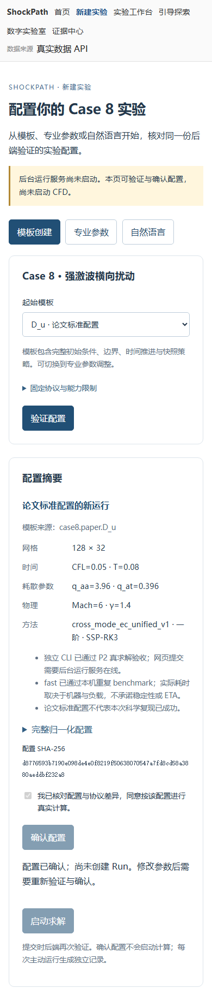
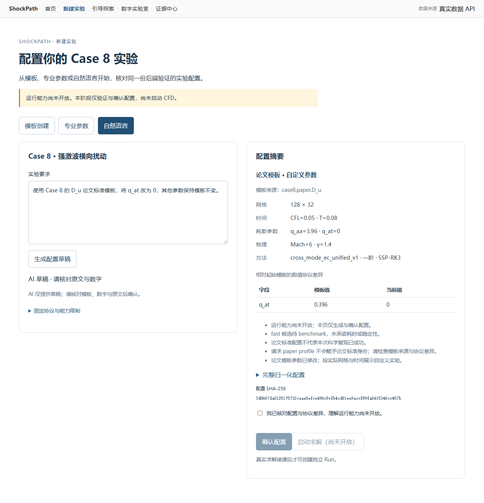

# V2-P1 实验创建验收

日期：2026-10-03（Asia/Shanghai）。用户要求“P0 已完成，现在进行 P1”。在已有 `codex/shockpath-v2` 工作区增量实现，保留原有未提交 P0 改动；没有新建/替换工作树，没有提交或推送，没有启动 CFD，没有修改科研源。

**交付状态：P1 完成，M1 通过。** 用户随后提供后端密钥，已使用真实 provider 完成 6 个 API 场景与 1 个真实浏览器端到端场景。密钥仅保存在 Git 忽略的 `.env` 中，由独立 PowerShell 后端启动脚本载入进程环境，没有进入源码、前端或验收日志。另有注入客户端/路由的异常测试，生产代码没有模拟 AI fallback。P2/P3 未实施，运行能力关闭。

## 1. 实际交付

| 内容 | 代码 / 行为 |
| --- | --- |
| 独立严格 V2 DTO | `backend/models/v2/experiment.py`；固定协议自动补全，strict/extra forbid/finite 校验，V1 模型不变 |
| Case / capability / 模板 | `backend/registry/v2/cases.py`；A/B/C/D paper 与 fast D_u 候选；输入验证与执行能力分离 |
| 统一验证 | `backend/services/v2/experiments.py`；归一化、固定/候选值、组合、能力版本、模板 lineage、差异与 SHA-256 |
| 版本化 API | `backend/api/v2/experiments.py`；cases / validate / parse-natural-language，独立 V2 错误 envelope、request id、no-store |
| 最小 DeepSeek 客户端 | `backend/ai/client.py`；后端环境密钥、官方 HTTPS 地址、JSON mode、有限响应/时间、错误分类、无自动重试/工具调用 |
| 本地后端配置 | `scripts/serve_backend.ps1`；PowerShell 7、允许字段列表、字面量 `.env` 值、进程环境优先、只在后端进程中加载 |
| AI 草稿 | `backend/ai/config_parser.py`；结构化提取→同一验证；未知/含糊/未支持要求阻止确认；不入队、不执行 |
| 创建页面 | `/experiments/new`；三入口、capability 驱动参数、完整摘要、协议差异、hash、用户勾选确认、确认时二次校验 |
| 修改失效 | 参数、入口、模板或原文改变会清空验证与确认；异步旧响应不会覆盖新输入；刷新重新加载能力 |
| 导航与兼容 | 首页卡片/导航增加新建入口；V1 旧 URL 保留；移动布局验证通过 |
| 生成契约 | OpenAPI/TypeScript 同步；P0 的 test contract gate 更新为合并契约可复现，同时单独验证 V1 子集不变 |

## 2. 验证结果

| 最终检查 | 实际结果 | 原始产物 |
| --- | --- | --- |
| 全量后端回归 | **1508 passed / 1 skipped，761.26s**；Windows symlink 权限项 skip，junction 与其余检查通过 | [p1_backend_tests.log](p1_backend_tests.log)、[p1_backend_results.xml](p1_backend_results.xml) |
| P1 + transport 最终版定向回归 | **145 passed，84.04s**；包含全量收集后补充的字段长度和 Content-Length 收尾保护 | [p1_final_targeted_tests.log](p1_final_targeted_tests.log)、[p1_final_targeted_results.xml](p1_final_targeted_results.xml) |
| V1+V2 frontend unit / real API / mock 浏览器回归 | **225 passed，9.1m** | [p1_v1_browser_results.xml](p1_v1_browser_results.xml) |
| P1 专用浏览器 | **5 passed，11.5s** | [p1_browser_results.json](p1_browser_results.json) |
| 真实 DeepSeek API | **6 场景 PASS**：三入口等价、论文改参、fast 候选、epsilon、含糊 paper、Mach 未支持 | [p1_live_ai_results.json](p1_live_ai_results.json) |
| 真实 DeepSeek 浏览器端到端 | **1 passed，12.4s**；三入口相同 hash、确认、论文改参、拒绝 epsilon、零 Run 请求 | [p1_live_browser_results.json](p1_live_browser_results.json) |
| 构建（含 vue-tsc） | **PASS**；保留既有 >500 kB bundle 告警 | README 复查命令与本次构建输出 |
| OpenAPI / types 可复现与 V1 子集 | **PASS**；50 paths / 333 schemas；运行时/独立导出/保存文件相等；生成 types byte-identical；原 47 V1 paths / 298 schemas 不变 | [p1_contracts.log](p1_contracts.log)、`test_v1_contract_subset_unchanged` |
| 公共资源 / 生产包扫描 | **PASS**；2438 assets；无本地绝对路径、mock 科学 provider 或禁止科学结论进入生产包 | [p1_public_audit.log](p1_public_audit.log)、[p1_production_scan.log](p1_production_scan.log) |
| 科研目录保护 | **PASS**；27,843 文件、5,429,811,970 bytes；path/size/mtime_ns/hash 一致；37 文件依赖锁复查通过 | [p1_source_preservation.json](p1_source_preservation.json) |
| 密钥隔离 | **PASS**；`.env` 为 Git ignore；扫描 backend、frontend/src、scripts、tests/v2_p1、docs/v2 发现实际密钥匹配数 0；后端 launcher 被真实 E2E 验证 | 本地忽略文件与实际扫描输出（不记录密钥值） |

OpenAPI SHA-256：`e9583ad16cc51e34dc8a65fc643a69a37c3c24e880633b7d4cee3a869f4cfac9`；types SHA-256：`177bf83e84eb2e9f22e4a2e38163200d10de61c1325b66115f46438864ee39c3`。全量回归期间新增的两项保护通过最终定向 suite 复查；各计数对应真实单次运行，不将不同运行相加冒充一次完整 suite。

已有完成的 P1 首轮检查：后端配置/草稿 85 passed，DeepSeek 客户端修正 Windows 超长参数名后的定向检查 21 passed；前端构建通过；专用浏览器 5 passed（11.5s）；OpenAPI 独立导出、运行时与保存文件一致，types 独立生成 byte-identical，V1 paths/schema 子集不变；public audit 和 production scan 通过。构建保留既有 bundle >500 kB 警告。

中间阶段 P1 与 6 个回归问题的定向检查 **120 passed（107.36s）**、字段长度保护 **2 passed**、客户端收尾保护 **22 passed**，均有独立日志；最终收敛为上表 145 项 suite。真实调用未创建 Run、未启动 CFD。

测试覆盖：完整标准协议与四模板、三入口等价、负零与数值表示归一化、论文 D→B 改参保留 lineage、改网格后的实际尺寸、无模板不获 paper 身份、fast 待 benchmark；未知字段/枚举、bool/字符串/小数网格、NaN/Inf、边界/候选/混合网格、非法 JSON/重复 key、非 JSON、64 KiB 限制、版本冲突；AI 正常/缺密钥/超时/错误 JSON/空/截断/超量响应/未支持/待澄清/明确数字丢失/其他 Case/诱导性能目标；确认二次校验、修改失效、手机布局、无 Run 请求。

首次全量后端尝试中，provider oversized fixture 的自动参数名过长触发 Windows 环境限制（产品代码未失败）。已改成简短 ids，停止该轮并重跑最终回归；最终计数单独记录，不将中止轮计为通过。

随后第一轮完整回归为 **1499 passed / 6 failed / 1 skipped（782.92s）**，记录在 `p1_backend_first_regression.log`：3 项旧 Case8 检查原先把所有版本都当 V1（exact operation IDs、V1 error codes、V1 FailedEnvelope），已明确按 `/api/v1/` 检查冻结合同，同时新增 V2 精确操作/error-schema 检查并保留完整 catalog/runtime equality；另 3 项导出相等检查受到回归期间追加 413 到保存 OpenAPI 的时序影响。V1 paths/schema 本身保持不变。全部 6 项定向复测通过，最终全量回归期间不再改契约/注册。末轮未知字段超长保护属于 V2 错误细节处理，并独立复测，避免非法用户字段导致服务器 500。

## 3. 操作演示

1. 按 README 启动 backend 和生产 frontend，进入 `/experiments/new`。
2. 模板创建选择 `case8.paper.D_u`，验证后为“论文标准配置的新运行”，核对 128×32、CFL=0.05、T=0.08、q_aa=3.96、q_at=0.396。
3. 专业参数保持同配置再验证，normalized config/hash 相同。改 q_at=0，分类变为“论文模板·自定义参数”，列出差异；明确选 B_u 模板才成为 B_u 标准配置。
4. 勾选核对声明，点击确认配置；后端再次验证，页面提示“尚未创建 Run”。再次修改参数会撤销确认；启动求解始终禁用。
5. 用 `pwsh -NoProfile -File ./scripts/serve_backend.ps1` 启动后端以加载本地密钥，再进入自然语言入口，输入“使用 Case 8 的 D_u 论文模板，把 q_at 改为 0”；得到 B 数值但保留 D 模板自定义身份。输入 epsilon/Gate/其他 Case 或含糊要求必须先澄清/报告不支持。移除密钥后仍有明确不可用提示，模板/专业参数可用。

默认 `DEEPSEEK_MODEL=deepseek-flash`、`DEEPSEEK_BASE_URL=https://api.deepseek.com`、`DEEPSEEK_TIMEOUT_SECONDS=30`；密钥只加载到 backend 进程环境，不放在前端。Python 入口不自动读取 `.env`，显式 PowerShell 启动脚本读取允许字段并保留已有环境设置。模型/JSON mode 实施时核对了 [官方 JSON Output 文档](https://api-docs.deepseek.com/guides/json_mode/) 与 [官方 Chat Completions 文档](https://api-docs.deepseek.com/api/create-chat-completion/)。账号连通证据是实际请求的 `p1_live_ai_results.json` 与真实浏览器结果，而非文档核查。

## 4. 明确留待后续

- 真实 DeepSeek 账号连通已通过；目前验收覆盖登记的六类文本，不能声称任意自然语言都能完全准确理解。仍要求用户核对完整配置。
- fast/custom 网格、步长、参数生效与稳定性待 P2，当前可验证不代表已能计算；不承诺实时耗时。
- P1 不存储实验或 Run。确认状态为页面内状态，刷新后重新输入/确认；没有任务队列或伪进度。
- P3 Run 创建必须复用 `validate_experiment`、重新核对 capability revision 和有效配置；预览 hash/标签不能作为执行权限或科学证据。
- 尚未有完整结果、证据、AI 结果解释或报告；V1 REAL API 为历史回放。

